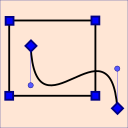

#   SixLabors.Shapes

**SixLabors.Shapes** is a new cross-platform 2D polygon manipulation AP.

[](https://ci.appveyor.com/project/six-labors/shapes/branch/master)
[](https://codecov.io/gh/SixLabors/Shapes)
[](https://raw.githubusercontent.com/SixLabors/Shapes/master/LICENSE.txt)

[](https://gitter.im/SixLabors/Shapes?utm_source=badge&utm_medium=badge&utm_campaign=pr-badge&utm_content=badge)
[](https://github.com/SixLabors/Shapes/issues)
[](https://github.com/SixLabors/Shapes/stargazers)
[](https://github.com/SixLabors/Shapes/network)

### Installation

**Pre-release downloads**

At present the code is pre-release we have initial pre-releases availible on [nuget](https://www.nuget.org/packages/SixLabors.Shapes/).

We also have a [MyGet package repository](https://www.myget.org/gallery/SixLabors) - for bleeding-edge / development NuGet releases.

### Manual build

If you prefer, you can compile SixLabors.Shapes yourself (please do and help!), you'll need:

- [Visual Studio 2017](https://www.visualstudio.com/en-us/news/releasenotes/vs2017-relnotes)
- The [.NET Core 1.0 SDK Installer](https://www.microsoft.com/net/core#windows) - Non VSCode link.

To clone it locally click the "Clone in Windows" button above or run the following git commands.

```bash
git clone https://github.com/SixLabors/Shapes.git
```

### Features

- Point in Polygon
- Line Intersections
- Complex Polygons
- Simple polygon clipping
- Regular Polygons (triangles, squares, pentagons etc, any number of sides)
- Ellipses (and therfore circles)
- Shape Builder api - for creating shapes declaratively 
- Polygons
   - With Linear line segments
   - With Beziear curve line segments
   - Mixture of both Linear & beziear segments
- Paths
   - With Linear line segments
   - With Beziear curve line segments
   - Mixture of both Linear & beziear segments

### How can you help?

Please... Spread the word, contribute algorithms, submit performance improvements, unit tests. 

### Projects using SixLabors.Shapes

* [ImageSharp](https://github.com/jimBobSquarePants/ImageSharp) - cross platform, fully manged, image manipultion and drawing library.

### The SixLabors.Shapes Team

Lead
- [Scott Williams](https://github.com/tocsoft)
