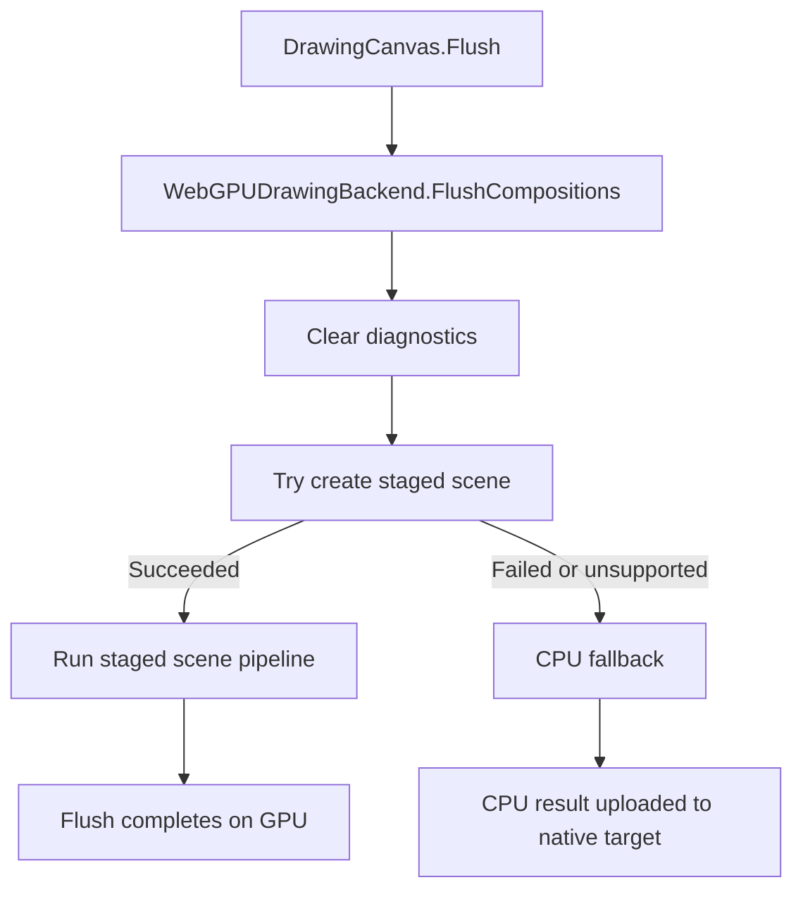
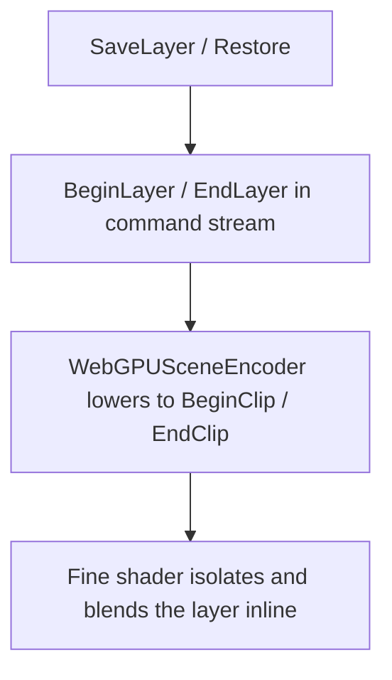

# WebGPU Backend

`WebGPUDrawingBackend` is the GPU execution backend for ImageSharp.Drawing. It receives one flush worth of prepared drawing commands, decides whether that flush can stay on the staged GPU path, and if so creates and dispatches the staged scene pipeline against a native WebGPU target.

The WebGPU backend and staged scene pipeline are based on ideas and implementation techniques from Vello, but the current ImageSharp.Drawing implementation is heavily adapted and no longer mirrors Vello one-for-one:

- https://github.com/linebender/vello

This document explains the backend as a newcomer would need to understand it:

- where the public WebGPU entry points fit
- what problem the WebGPU backend is solving
- what `WebGPUDrawingBackend` actually owns
- how one flush moves through the backend boundary
- where fallback, explicit layer handling, and runtime caching fit into the design

## Where The Public WebGPU Types Fit

The public WebGPU surface area around this backend is small and target-first. Most applications only reach for the recommended types; the advanced types exist as escape hatches for unusual interop scenarios.

**Recommended types** — the entry points most applications should use:

- `WebGPUEnvironment` exposes explicit support probes for the library-managed WebGPU environment
- `WebGPUWindow<TPixel>` owns a native window and either runs a render loop or returns `WebGPUSurfaceFrame<TPixel>` instances through `TryAcquireFrame(...)`
- `WebGPUExternalSurface<TPixel>` attaches to a caller-owned native host via `WebGPUSurfaceHost`; the host application owns the UI object and tells the external surface when the drawable framebuffer resizes
- `WebGPURenderTarget<TPixel>` owns an offscreen native target for GPU rendering, hybrid CPU plus GPU canvases, and readback

**Advanced types** — interop escape hatches for applications that already own a WebGPU device, queue, or native surface:

- `WebGPUDeviceContext<TPixel>` wraps a shared or caller-owned device and queue and creates native-only or hybrid frames and canvases over external textures
- `WebGPUNativeSurfaceFactory` is the low-level escape hatch for caller-owned native targets

Those types all exist to get a `DrawingCanvas` over a native WebGPU target. Once the canvas flushes, `WebGPUDrawingBackend` becomes the execution boundary.

The support probes also live outside the backend:

- `WebGPUEnvironment.ProbeAvailability()` checks whether the library-managed WebGPU device and queue can be acquired
- `WebGPUEnvironment.ProbeComputePipelineSupport()` runs the crash-isolated trivial compute-pipeline probe

That split keeps support probing separate from flush execution. `WebGPUDrawingBackend` is the flush executor, not the public support API. The WebGPU constructors create their objects directly; callers use `WebGPUEnvironment` when they want explicit preflight checks.

## The Main Problem

The canvas hands the backend a prepared composition scene. That is already a big simplification, but it does not mean the GPU can render that scene directly.

The backend still has to decide:

- whether the target and scene are eligible for the GPU path
- whether the staged scene can be created safely and legally on the current device
- when the backend should remain on the GPU and when it should fall back
- how GPU-only concerns such as native targets, flush-scoped resources, and device-scoped caches fit around the staged raster pipeline

That is why the backend layer exists separately from the staged scene pipeline itself.

The raster pipeline solves "how to rasterize this encoded scene on the GPU".  
`WebGPUDrawingBackend` solves "should this flush go there, and how does the system manage that decision cleanly".

## The Core Idea

The WebGPU backend is a policy and orchestration layer around a staged GPU rasterizer.

Its central idea is:

> decide at the backend boundary whether the flush can stay on the GPU, then either run the staged scene pipeline as one flush-scoped unit of work or fall back cleanly

That means `WebGPUDrawingBackend` is responsible for entry-point orchestration, not for every low-level GPU detail.

## The Most Important Terms

### Backend

`WebGPUDrawingBackend` is the top-level GPU executor. It owns:

- per-flush diagnostic state
- staged-scene creation attempts
- the decision to run the staged path or fall back
- lowering explicit layer boundaries into the staged scene path

It is the policy boundary of the GPU path.

It does not own:

- public support probing
- window creation
- render-target allocation APIs
- caller-device or caller-surface interop setup

### Flush Context

`WebGPUFlushContext` is the flush-scoped execution context for one GPU flush.

It owns:

- the runtime lease
- device and queue access
- the target texture and target view
- the command encoder and optional compute pass encoder
- the native resources created during the flush

The important lifetime rule is:

most GPU state is flush-scoped, but two cache layers intentionally outlive one flush:

- `WebGPURuntime.DeviceSharedState` keeps device-scoped pipelines and support state
- `WebGPUDrawingBackend` keeps reusable resource arenas and retained scratch capacities for later flushes on the same backend instance

### Staged Scene

A staged scene is the GPU-oriented representation of one flush.

It is produced by the encoder and then consumed by the staged raster pipeline. The staged scene itself is explained in the rasterizer document; from the backend point of view, it is the unit of GPU work that either succeeds as a whole or causes fallback.

### Fallback

Fallback means the backend gives the flush to `DefaultDrawingBackend` and then uploads the CPU result into the native target.

Fallback is part of the design, not an error-handling afterthought. The backend is built to decide as early and cleanly as possible when the staged GPU path cannot or should not run.

## The Big Picture Flow

The easiest way to understand the backend is to follow one normal flush from entry to backend decision.

The staged scene pipeline itself is described in [`WEBGPU_RASTERIZER.md`](d:/GitHub/SixLabors/ImageSharp.Drawing/src/ImageSharp.Drawing.WebGPU/WEBGPU_RASTERIZER.md). The important backend point is that the whole GPU flush is treated as one coherent attempt.

## What `WebGPUDrawingBackend` Owns

`WebGPUDrawingBackend` is deliberately smaller than the total amount of GPU code around it. It owns orchestration and policy, not the full details of scene encoding or dispatch.

Its responsibilities are:

- clear per-flush diagnostics
- try to create a staged scene
- run the staged path if scene creation succeeds
- fall back cleanly if any stage fails
- keep explicit layer boundaries in the shared flush model until the staged scene encoder lowers them
- retain the last successful scratch capacities and reuse backend-local GPU arenas across flushes when possible

The expensive staged work is delegated:

- `WebGPUSceneEncoder` owns scene encoding
- `WebGPUSceneConfig` owns planning data
- `WebGPUSceneResources` owns flush-scoped GPU resources
- `WebGPUSceneDispatch` owns the staged compute pipeline

The public object graph around those responsibilities is also separate:

- `WebGPUEnvironment` handles explicit support probes
- `WebGPUWindow<TPixel>`, `WebGPUExternalSurface<TPixel>`, and `WebGPURenderTarget<TPixel>` are the recommended target constructors; `WebGPUDeviceContext<TPixel>` and `WebGPUNativeSurfaceFactory` are advanced interop escape hatches for caller-owned devices or surfaces
- `DrawingCanvas` hands a prepared `CompositionScene` to the backend

## The Flush Boundary

`FlushCompositions<TPixel>(...)` in `WebGPUDrawingBackend.cs` is the top-level scene flush entry point.

Its job is intentionally narrow:

- clear the previous diagnostics
- try to build a staged GPU scene for the current flush
- run the staged pipeline if that creation succeeds
- fall back if creation, validation, or dispatch cannot complete safely

Keeping those decisions at the boundary is important. The backend is designed to avoid discovering halfway through execution that one part of the scene ran on the GPU and another must suddenly fall back.

## Scene Eligibility

Before the expensive GPU work begins, the backend performs a scene-level eligibility check through the encoder path.

That check answers the first important question:

"is this flush even a candidate for the staged WebGPU path"

This is distinct from later GPU planning checks. At this stage the backend is only trying to rule out unsupported scene features early, before it starts creating resources or recording dispatches.

## Flush Context Creation

If the scene is eligible, the backend creates a `WebGPUFlushContext`.

This is the point where the abstract prepared scene becomes tied to:

- a concrete device
- a concrete queue
- a concrete native target
- a concrete command encoder

The flush context is also the ownership boundary for flush-scoped GPU resources. When the flush ends, those resources leave with the context unless they are part of device-shared runtime state.

## Fallback As Part Of The Architecture

If any stage fails, `FlushCompositionsFallback(...)` runs the scene on `DefaultDrawingBackend` and uploads the CPU result into the native target.

Fallback covers cases such as:

- unsupported scene features
- unsupported target or format conditions
- binding-limit failures
- resource-creation failures
- dispatch failures

The architectural goal is simple:

decide as much as possible up front, fall back cleanly, and avoid leaving the flush half-executed across two backends.

## Explicit Layers

Explicit layers are not a separate compose pass in this backend.

They stay in the shared composition command stream as `BeginLayer` and `EndLayer`, then the staged scene encoder lowers those boundaries into `BeginClip` and `EndClip` records inside the encoded scene. The fine shader interprets those records directly: it pushes the current tile color to its clip stack at `BeginClip`, renders the isolated layer contents, and then blends that isolated result back into the saved backdrop at `EndClip`.

That means layer semantics are part of the main staged scene pipeline rather than a second GPU composition subsystem.

## Runtime And Caching

`WebGPURuntime` and `WebGPURuntime.DeviceSharedState` hold the device-scoped resources that outlive a single flush.

They cache things such as:

- device access
- compute pipelines
- composite pipelines
- a small amount of reusable device-scoped support state

`WebGPURuntime` also backs the explicit support probes surfaced by `WebGPUEnvironment`. The probe and runtime layer is where the library-managed device/queue availability and crash-isolated compute-pipeline test are cached.

`WebGPUDrawingBackend` adds one more cache layer above that device-scoped runtime state. It retains:

- the last successful staged-scene scratch capacities
- reusable scheduling and resource arenas whose buffers can be leased by later flushes on the same backend instance

The arena contents are still per-flush; only the underlying allocations are reused.

That split keeps flushes isolated while still allowing both device-scoped state and backend-local buffer allocations to be reused.

## Relationship To The Rasterizer Doc

This document stops at the backend boundary and the high-level flush flow.

The staged scene pipeline itself is described in [`WEBGPU_RASTERIZER.md`](d:/GitHub/SixLabors/ImageSharp.Drawing/src/ImageSharp.Drawing.WebGPU/WEBGPU_RASTERIZER.md), including:

- scene encoding
- planning
- resource creation
- scheduling passes
- fine rasterization
- chunked oversized-scene execution
- copy and submission

## Reading Guide

If you want to understand the backend first, read the code in this order:

1. `WebGPUEnvironment.cs`
2. `WebGPUWindow{TPixel}.cs`, `WebGPUSurfaceFrame{TPixel}.cs`, `WebGPUExternalSurface{TPixel}.cs`, `WebGPUSurfaceHost.cs`, `WebGPURenderTarget{TPixel}.cs`, and `WebGPUDeviceContext{TPixel}.cs`
3. `WebGPUDrawingBackend.cs`
4. `WebGPUFlushContext.cs`
5. `WebGPURuntime.cs`
6. `WebGPURuntime.DeviceSharedState.cs`
7. `WEBGPU_RASTERIZER.md`

That order mirrors the newcomer view of the system:

support and target setup -> backend policy -> flush context -> runtime lifetime -> staged raster pipeline

## The Mental Model To Keep

The easiest way to keep this backend straight is to remember that it is not the rasterizer itself. It is the orchestration and policy layer around a staged GPU rasterizer. It decides whether a flush can stay on the GPU, runs that staged path as one flush-scoped unit of work, and falls back cleanly when it cannot.

If that model is clear, the major types fall into place:

- `WebGPUEnvironment` exposes explicit support probes
- `WebGPUWindow<TPixel>`, `WebGPUExternalSurface<TPixel>`, and `WebGPURenderTarget<TPixel>` are the recommended target types; `WebGPUDeviceContext<TPixel>` and `WebGPUNativeSurfaceFactory` are advanced interop escape hatches
- `WebGPUDrawingBackend` orchestrates and decides policy
- `WebGPUFlushContext` owns one flush's execution state
- `WebGPURuntime` owns longer-lived device state
- the staged scene pipeline is a separate subsystem described in the rasterizer doc
