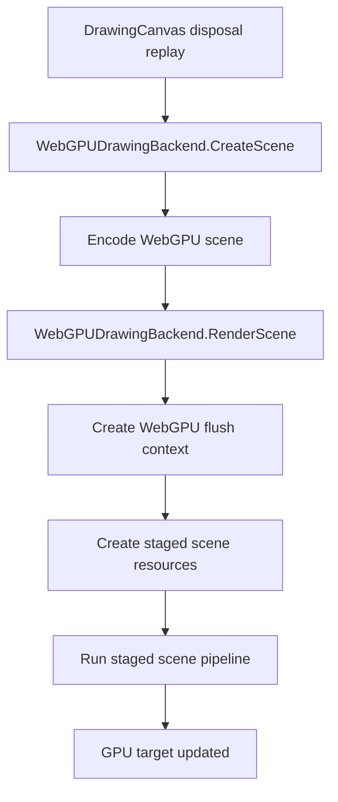
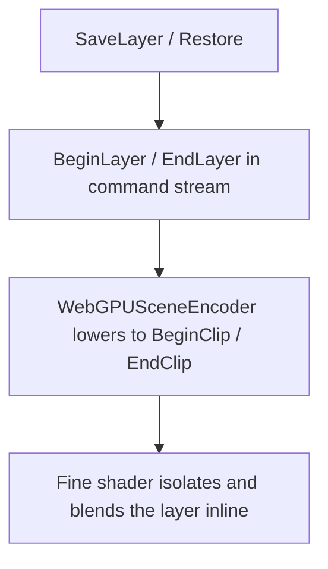

# WebGPU Backend

`WebGPUDrawingBackend` is the GPU execution backend for ImageSharp.Drawing. It creates retained GPU scenes from prepared drawing command batches, then renders those scenes through the staged GPU pipeline against a native WebGPU target.

The WebGPU backend and staged scene pipeline are based on ideas and implementation techniques from Vello, but the current ImageSharp.Drawing implementation is heavily adapted and no longer mirrors Vello one-for-one:

- https://github.com/linebender/vello

This document explains the backend as a newcomer would need to understand it:

- where the public WebGPU entry points fit
- what problem the WebGPU backend is solving
- what `WebGPUDrawingBackend` actually owns
- how one command batch moves through the backend boundary
- where explicit layer handling and runtime caching fit into the design

## Where The Public WebGPU Types Fit

The public WebGPU surface area around this backend is small and target-first.

**Public types**, the entry points applications should use:

- `WebGPUEnvironment` exposes explicit support probes for the library-managed WebGPU environment
- `WebGPUWindow` owns a native window and either runs a render loop or returns `WebGPUSurfaceFrame` instances through `TryAcquireFrame(...)`
- `WebGPUExternalSurface` attaches to a caller-owned native host via `WebGPUSurfaceHost`; the host application owns the UI object and tells the external surface when the drawable framebuffer resizes
- `WebGPURenderTarget` owns an offscreen native target for GPU rendering and readback

`WebGPURenderTarget.CreateRenderTarget(...)` and `WebGPUSurfaceFrame.CreateRenderTarget(...)` create empty offscreen render targets with the same texture format as the source target or frame. They do not copy pixels from the source.

`WebGPUDeviceContext` is internal infrastructure used by targets and surfaces. It is not part of the public WebGPU entry-point model.

`WebGPUEnvironment.Options` configures the library-managed WebGPU environment before first use. Set it before
constructing WebGPU objects or calling support probes; the shared runtime reads the current options during first
initialization and does not reconfigure an existing device after that point.

Those types all exist to get a `DrawingCanvas` over a native WebGPU target. Once the canvas flushes, `WebGPUDrawingBackend` becomes the execution boundary.

The support probes also live outside the backend:

- `WebGPUEnvironment.ProbeAvailability()` checks whether the required WGPU extension is available and the library-managed WebGPU device and queue can be acquired; it reports `WgpuExtensionUnavailable` separately from core API initialization failure
- `WebGPUEnvironment.ProbeComputePipelineSupport()` runs the crash-isolated trivial compute-pipeline probe

That split keeps support probing separate from flush execution. `WebGPUDrawingBackend` is the flush executor, not the public support API. The WebGPU constructors create their objects directly; callers use `WebGPUEnvironment` when they want explicit preflight checks.

## The Main Problem

The canvas hands the backend a prepared command batch. That is already a big simplification, but it does not mean the GPU can render that batch directly.

The backend still has to decide:

- whether the typed target can accept the retained WebGPU scene
- whether the staged scene can be created safely and legally on the current device
- how GPU-only concerns such as native targets, flush-scoped resources, and device-scoped caches fit around the staged raster pipeline

That is why the backend layer exists separately from the staged scene pipeline itself.

The raster pipeline solves "how to rasterize this encoded scene on the GPU".
`WebGPUDrawingBackend` solves "how does this retained scene bind to the current typed target and render cleanly".

## The Core Idea

The WebGPU backend is a policy and orchestration layer around a staged GPU rasterizer.

Its central idea is:

> create a retained encoded scene from prepared commands, then render that scene as one staged GPU unit of work

That means `WebGPUDrawingBackend` is responsible for entry-point orchestration, not for every low-level GPU detail.

## The Most Important Terms

### Backend

`WebGPUDrawingBackend` is the top-level GPU executor. It owns:

- per-flush diagnostic state
- staged-scene creation attempts during render
- keeping explicit layer boundaries in the shared command stream until scene encoding

It is the policy boundary of the GPU path.

It does not own:

- public support probing
- window creation
- render-target allocation APIs
- caller-device or caller-surface interop setup

### Flush Context

`WebGPUFlushContext` is the flush-scoped execution context for one GPU flush.

It owns:

- the runtime lease
- device and queue access
- the target texture and target view
- the command encoder and optional compute pass encoder
- the native resources created during the flush

The important lifetime rule is:

most GPU state is flush-scoped, but two cache layers intentionally outlive one flush:

- `WebGPURuntime.DeviceSharedState` keeps device-scoped pipelines and support state
- `WebGPUDrawingBackend` keeps reusable resource arenas and retained scratch capacities for later flushes on the same backend instance

### Staged Scene

A staged scene is the GPU-oriented render-time representation of one retained encoded scene.

It is produced from the retained encoded scene and then consumed by the staged raster pipeline. The staged scene itself is explained in the rasterizer document; from the backend point of view, it is the render-scoped unit of GPU work.

## The Big Picture Flow

The easiest way to understand the backend is to follow one command-range timeline entry from canvas disposal to GPU submission.

```mermaid
flowchart TD
    A[DrawingCanvas disposal replay] --> B[WebGPUDrawingBackend.CreateScene]
    B --> C[Encode WebGPU scene]
    C --> D[WebGPUDrawingBackend.RenderScene]
    D --> E[Create WebGPU flush context]
    E --> F[Create staged scene resources]
    F --> G[Run staged scene pipeline]
    G --> H[GPU target updated]
```

The staged scene pipeline itself is described in [`WEBGPU_RASTERIZER.md`](d:/GitHub/SixLabors/ImageSharp.Drawing/src/ImageSharp.Drawing.WebGPU/WEBGPU_RASTERIZER.md). The important backend point is that scene creation is retained and untyped, while rendering is target-bound and typed.

## What `WebGPUDrawingBackend` Owns

`WebGPUDrawingBackend` is deliberately smaller than the total amount of GPU code around it. It owns orchestration and policy, not the full details of scene encoding or dispatch.

Its responsibilities are:

- clear per-render diagnostics
- encode retained WebGPU scenes from prepared command batches, choosing between the parallel encoder and the ordered encoder
- create render-scoped staged scene resources
- run the staged path inside a bounded scratch-growth retry loop
- execute the transactional ordered plan (render ranges, Apply groups, and explicit layer transitions) when the scene retains one
- keep explicit layer boundaries in the shared flush model until the staged scene encoder lowers them
- retain the last successful scratch capacities, chunk-height hints, and backend-local GPU arenas across renders when possible
- serve strictly typed GPU readback through `ReadRegion<TPixel>(...)`

The expensive staged work is delegated:

- `WebGPUSceneEncoder` owns scene encoding
- `WebGPUSceneConfig` owns planning data
- `WebGPUSceneResources` owns flush-scoped GPU resources
- `WebGPUSceneDispatch` owns the staged compute pipeline
- `GpuSceneDrawTag` and related GPU scene structs describe packed scene words shared with WGSL

The public object graph around those responsibilities is also separate:

- `WebGPUEnvironment` handles explicit support probes
- `WebGPUWindow`, `WebGPUExternalSurface`, and `WebGPURenderTarget` are the public target constructors
- `DrawingCanvas` hands prepared `DrawingCommandBatch` ranges to the backend

## The Backend Boundary

`CreateScene(...)` and `RenderScene<TPixel>(...)` split retained scene creation from typed target rendering.

`CreateScene(...)`:

- receives target bounds and a prepared command batch
- encodes the retained `WebGPUEncodedScene` through `WebGPUSceneEncoder.TryEncode(...)`, or through `WebGPUSceneEncoder.TryEncodeOrdered(...)` when the batch contains Apply
- stores retained scratch-size state and reusable arena slots with the scene
- does not need `TPixel`, the target frame, or a `WebGPUFlushContext`

`RenderScene<TPixel>(...)`:

- validates the retained scene type, the target texture format, and target bounds
- resolves `TPixel` to the WebGPU texture format and required feature
- creates the render-scoped `WebGPUFlushContext`
- creates staged resources and dispatches the GPU pipeline, retrying with grown scratch capacities when the GPU reports overflow

Keeping those lifetimes separate avoids duplicate target setup when the same retained scene is rendered repeatedly.

## Scene Encoding

Before render-scoped GPU work begins, `CreateScene(...)` encodes the prepared command batch.

That step answers the first important question:

"can these prepared commands become WebGPU encoded scene data"

This is distinct from later GPU planning checks. Scene encoding uses target bounds and the allocator, but not the typed target frame.

Encoding is parallel by default. `TryEncode(...)` splits large batches into contiguous command-range partitions and encodes them concurrently:

- clip scopes do not serialize the scene; a cheap sequential prescan records the clip scopes open at each partition boundary, and each partition replays those seed clips before its range and closes its own, so the concatenated partitions form one balanced clip stream
- layer scopes cannot be replayed that way because a layer composites its contents as one group when it closes, so partition boundaries snap forward to the next command index where no layer scope is open (layer depth zero)
- the partitions are concatenated in timeline order into one packed scene buffer

Batches containing Apply take `TryEncodeOrdered(...)` instead: Apply reads pixels back mid-scene, so operations before and after it must stay in submission order and encoding stays sequential.

## Ordered Scenes: Apply And Scoped Layers

Most scenes encode into one packed draw stream that renders as a single staged dispatch. Scenes containing Apply, and layers that contain Apply, encode instead into a flat ordered `WebGPUSceneOperation` plan retained with the scene. There are four operation kinds:

- `RenderRange` renders one encoded draw range into the current target
- `Apply` retains the processor and draw range; maximal consecutive Applies whose source reads cannot observe an earlier Apply write share one pixel-readback barrier
- `BeginLayer` enters a stable transient layer target cleared to transparent black
- `EndLayer` returns to the parent target and composites the layer through the retained range's external texture binding

`RenderScene<TPixel>(...)` executes that plan in order inside one flush context. Range output stays in per-target ping-pong textures until allocator status has been validated at an Apply or final barrier. A barrier maps one flush-local status/pixel buffer once; allocator overflow grows all scratch capacities together and replays only retained GPU ranges from durable target checkpoints. Apply callbacks are never replayed. Plain scenes never allocate the operation plan and take the single staged-dispatch path.

## Flush Context Creation

When the retained scene is rendered, the backend creates a `WebGPUFlushContext`.

This is the point where the retained encoded scene becomes tied to:

- a concrete device
- a concrete queue
- a concrete native target
- a concrete command encoder

The flush context is also the ownership boundary for flush-scoped GPU resources. When the flush ends, those resources leave with the context unless they are part of device-shared runtime state.

## Explicit Layers

Explicit layers are not a separate compose pass in this backend.

They stay in the shared composition command stream as `BeginLayer` and `EndLayer`, then the staged scene encoder lowers those boundaries into `BeginClip` and `EndClip` records inside the encoded scene (the layer bounds become a rectangular clip path). The fine shader interprets those records directly: it pushes the current tile color to its clip stack at `BeginClip`, renders the isolated layer contents, and then blends that isolated result back into the saved backdrop at `EndClip` with the layer's stored blend mode and alpha.

```mermaid
flowchart TD
    A[SaveLayer / Restore] --> B[BeginLayer / EndLayer in command stream]
    B --> C[WebGPUSceneEncoder lowers to BeginClip / EndClip]
    C --> D[Fine shader isolates and blends the layer inline]
```

That means layer semantics are part of the main staged scene pipeline rather than a second GPU composition subsystem.

The one exception is a layer containing Apply. The ordered encoder retains explicit `BeginLayer` and `EndLayer` operations around the layer's child ranges. The transactional executor can then replay work across root and nested-layer targets without recursively rebuilding operation topology.

## Scratch Growth And Retry

The staged pipeline's scratch buffers (lines, binning, path rows, path tiles, segment counts, segments, blend spill, PTCL) are sized by GPU bump allocators, not by exact CPU precomputation. The backend therefore runs each staged render inside a bounded retry loop:

- the first GPU stage zeroes the bump counters on the GPU and never cancels the pipeline, so every stage reports its true scratch demand in a single pass
- after submission the backend reads the counters back; if any counter exceeded its capacity the attempt's output is discarded and the render retries with grown sizes
- earlier overflows can hide later-stage demand, so the retry budget allows one failed pass per tracked allocator plus a small margin (`MaxDynamicGrowthAttempts`)
- the largest observed sizes are retained both on the scene and on the backend instance, so later flushes start at proven capacities

## Typed Readback

`ReadRegion<TPixel>(...)` copies a region of a native WebGPU target back into an ImageSharp pixel buffer. Readback is strictly typed to the surface format by design: the requested pixel type must match the target's native texture format exactly, otherwise the call throws. No pixel conversion happens on this path; callers that need a different layout read the native format and convert on the CPU.

The canvas factory applies the same typing rule at creation time: a canvas over an `Rgba8Unorm` surface is typed `Rgba32`, and a canvas over a `Bgra8Unorm` surface is typed `Bgra32`.

## Runtime And Caching

`WebGPURuntime` and `WebGPURuntime.DeviceSharedState` hold the device-scoped resources that outlive a single flush.

They cache things such as:

- device access
- compute pipelines
- composite pipelines
- a small amount of reusable device-scoped support state

`WebGPURuntime` also backs the explicit support probes surfaced by `WebGPUEnvironment`. The probe and runtime layer is where required WGPU-extension availability, library-managed device/queue availability, and the crash-isolated compute-pipeline test are cached.

`WebGPUDrawingBackend` adds one more cache layer above that device-scoped runtime state. It retains:

- the last successful staged-scene scratch capacities
- reusable scheduling and resource arenas whose buffers can be leased by later flushes on the same backend instance
- an advisory chunk-height hint for repeated oversized scenes, so the chunked path starts near a proven window size (every hinted chunk is still validated before dispatch)

The arena contents are still per-flush; only the underlying allocations are reused.

That split keeps flushes isolated while still allowing both device-scoped state and backend-local buffer allocations to be reused.

## Relationship To The Rasterizer Doc

This document stops at the backend boundary and the high-level flush flow.

The staged scene pipeline itself is described in [`WEBGPU_RASTERIZER.md`](d:/GitHub/SixLabors/ImageSharp.Drawing/src/ImageSharp.Drawing.WebGPU/WEBGPU_RASTERIZER.md), including:

- scene encoding
- planning
- resource creation
- scheduling passes
- fine rasterization
- the scratch overflow protocol
- chunked oversized-scene execution
- readback, copy, and submission

## Reading Guide

If you want to understand the backend first, read the code in this order:

1. `WebGPUEnvironment.cs`
2. `WebGPUWindow.cs`, `WebGPUSurfaceFrame.cs`, `WebGPUExternalSurface.cs`, `WebGPUSurfaceHost.cs`, `WebGPURenderTarget.cs`, and `WebGPUDeviceContext.cs`
3. `WebGPUDrawingBackend.cs` and its partials (`WebGPUDrawingBackend.Readback.cs`, `WebGPUDrawingBackend.CopyPixels.cs`, `WebGPUDrawingBackend.CompositePixels.cs`)
4. `WebGPUSceneOperations.cs` and `WebGPUDrawingBackend.Ordered.cs` for the ordered Apply/layer plan and transactional executor
5. `WebGPUFlushContext.cs`
6. `WebGPURuntime.cs`
7. `WebGPURuntime.DeviceSharedState.cs`
8. `WEBGPU_RASTERIZER.md`
9. `GpuSceneDrawTag.cs`, `GpuSceneDrawMonoid.cs`, and the packed GPU record structs in `WebGPUSceneResources.cs` when following the shader contract

That order mirrors the newcomer view of the system:

support and target setup -> backend policy -> flush context -> runtime lifetime -> staged raster pipeline

## The Mental Model To Keep

The easiest way to keep this backend straight is to remember that it is not the rasterizer itself. It is the orchestration layer around a staged GPU rasterizer. It creates retained encoded scenes from prepared command batches, then renders those scenes as flush-scoped GPU work when a typed native target is available.

If that model is clear, the major types fall into place:

- `WebGPUEnvironment` exposes explicit support probes
- `WebGPUWindow`, `WebGPUExternalSurface`, and `WebGPURenderTarget` are the public target types
- `WebGPUDrawingBackend` orchestrates and decides policy
- `WebGPUFlushContext` owns one flush's execution state
- `WebGPURuntime` owns longer-lived device state
- the staged scene pipeline is a separate subsystem described in the rasterizer doc
