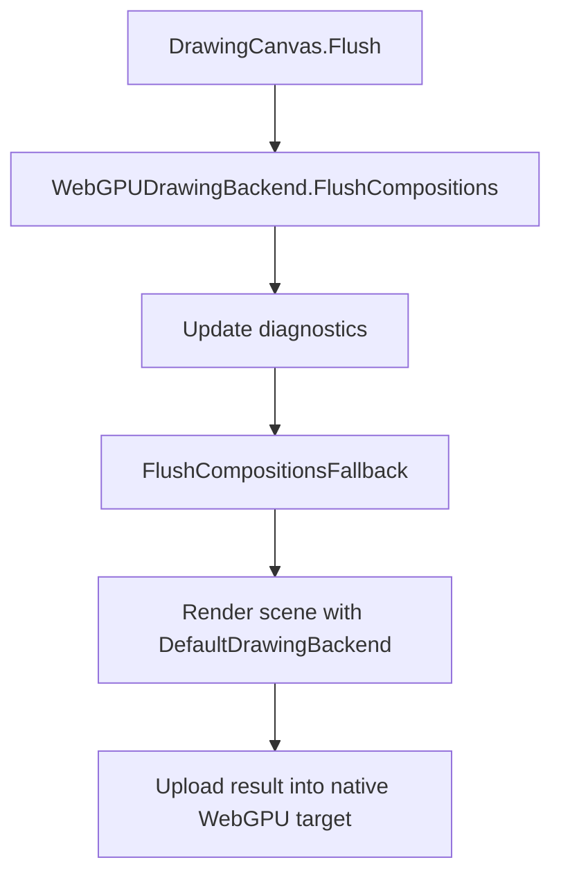
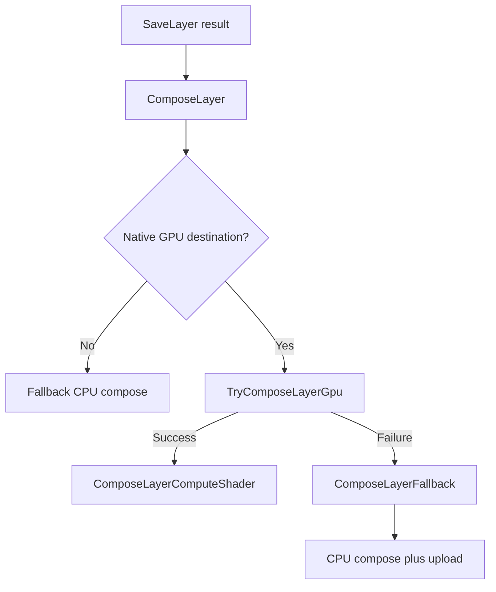
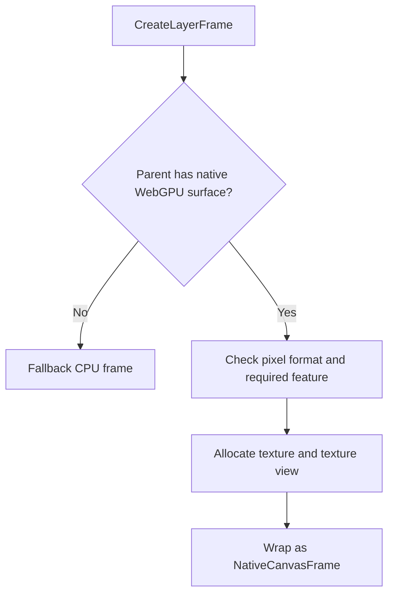

# WebGPUDrawingBackend

`WebGPUDrawingBackend` is in a transitional state.

The old scene rasterizer has been removed. Scene flushes now fall back to the CPU backend, and the only active GPU rendering path left in this project is GPU layer composition. This document describes that current reality so the code and docs stay aligned while the replacement rasterizer is built.

## Overview

Today the backend does two distinct jobs:

1. Provide WebGPU-backed layer frames and layer composition when the target surface is native.
2. Defer normal drawing-scene flushes to `DefaultDrawingBackend`.

That means the backend is still useful, but only for the parts that are already clean and bounded. The removed scene rasterizer is intentionally not described here as an active system.

## Current Flush Behavior

For `FlushCompositions(...)`, the backend now behaves as a fallback coordinator:

This is deliberate. The previous GPU scene path was removed rather than left half-alive.

### What FlushCompositions Does Now

`FlushCompositions<TPixel>(...)` in [WebGPUDrawingBackend.cs](/d:/GitHub/SixLabors/ImageSharp.Drawing/src/ImageSharp.Drawing.WebGPU/WebGPUDrawingBackend.cs):

- records fallback diagnostics
- reports that the WebGPU scene rasterizer is unavailable
- delegates scene rendering to `FlushCompositionsFallback(...)`

`FlushCompositionsFallback(...)` then:

- allocates a CPU staging frame
- renders the scene with `DefaultDrawingBackend`
- uploads the final pixel region into the target WebGPU texture

There is no intermediate GPU scene planner, no GPU edge builder, and no GPU fine raster pass in the current implementation.

## Active GPU Path: Layer Composition

Layer composition is still GPU-backed and is the part of the backend that remains active.

This path lives primarily in:

- [WebGPUDrawingBackend.ComposeLayer.cs](/d:/GitHub/SixLabors/ImageSharp.Drawing/src/ImageSharp.Drawing.WebGPU/WebGPUDrawingBackend.ComposeLayer.cs)
- [ComposeLayerComputeShader.cs](/d:/GitHub/SixLabors/ImageSharp.Drawing/src/ImageSharp.Drawing.WebGPU/Shaders/ComposeLayerComputeShader.cs)
- [CompositionShaderSnippets.cs](/d:/GitHub/SixLabors/ImageSharp.Drawing/src/ImageSharp.Drawing.WebGPU/Shaders/CompositionShaderSnippets.cs)

### Why This Path Survived

The layer-composition path already has the right properties:

- bounded work
- simple resource lifetime
- no giant flush-wide raster buffers
- direct use of final pixel data instead of a scene-wide vector raster pipeline

That makes it safe to keep while the scene rasterizer is replaced.

## Resource Model

The backend still owns the common WebGPU infrastructure needed by the surviving GPU path:

- device probing
- transient texture creation
- native layer frame allocation
- command submission
- GPU readback helpers

Those helpers live in:

- [WebGPUDrawingBackend.cs](/d:/GitHub/SixLabors/ImageSharp.Drawing/src/ImageSharp.Drawing.WebGPU/WebGPUDrawingBackend.cs)
- [WebGPUFlushContext.cs](/d:/GitHub/SixLabors/ImageSharp.Drawing/src/ImageSharp.Drawing.WebGPU/WebGPUFlushContext.cs)
- [WebGPUDrawingBackend.Readback.cs](/d:/GitHub/SixLabors/ImageSharp.Drawing/src/ImageSharp.Drawing.WebGPU/WebGPUDrawingBackend.Readback.cs)
- [WebGPUTextureSampleTypeHelper.cs](/d:/GitHub/SixLabors/ImageSharp.Drawing/src/ImageSharp.Drawing.WebGPU/WebGPUTextureSampleTypeHelper.cs)

## Layer Frame Lifecycle

`CreateLayerFrame(...)` still attempts GPU allocation first when the parent surface is native.

`ReleaseFrameResources(...)` releases those texture handles when the frame is GPU-backed, or delegates to the CPU backend otherwise.

## Diagnostics

The scene-flush diagnostics now reflect the removed rasterizer:

- GPU scene execution counters remain unchanged by `FlushCompositions(...)`
- fallback counters increase for every scene flush
- `TestingLastGPUInitializationFailure` is set to `"WebGPU scene rasterizer removed pending replacement."`
- compute-path scene counters are reset to `0`

That keeps the diagnostic surface honest.

## What Was Removed

The following pieces are no longer part of the active backend:

- the scene flush planner
- GPU edge preparation for scene fills
- the path-tiling compute pass
- the fine raster/composite scene shader
- the old scene-raster buffer packing logic

Those files were intentionally deleted rather than left dormant.

## Replacement Direction

The eventual replacement scene rasterizer is expected to be a bounded staged design rather than a monolithic flush-wide raster pass. This document does not describe that future system yet, because it does not exist in the codebase today.

Until that replacement lands, the contract is simple:

- scene flushes use CPU rendering plus upload
- layer composition can still use WebGPU directly

## Reading Order

If you want to understand the current backend, read the files in this order:

1. [WebGPUDrawingBackend.cs](/d:/GitHub/SixLabors/ImageSharp.Drawing/src/ImageSharp.Drawing.WebGPU/WebGPUDrawingBackend.cs)
2. [WebGPUDrawingBackend.ComposeLayer.cs](/d:/GitHub/SixLabors/ImageSharp.Drawing/src/ImageSharp.Drawing.WebGPU/WebGPUDrawingBackend.ComposeLayer.cs)
3. [WebGPUFlushContext.cs](/d:/GitHub/SixLabors/ImageSharp.Drawing/src/ImageSharp.Drawing.WebGPU/WebGPUFlushContext.cs)
4. [ComposeLayerComputeShader.cs](/d:/GitHub/SixLabors/ImageSharp.Drawing/src/ImageSharp.Drawing.WebGPU/Shaders/ComposeLayerComputeShader.cs)
5. [CompositionShaderSnippets.cs](/d:/GitHub/SixLabors/ImageSharp.Drawing/src/ImageSharp.Drawing.WebGPU/Shaders/CompositionShaderSnippets.cs)

## Summary

The current WebGPU backend is intentionally smaller than before:

- it no longer contains a scene rasterizer
- it still supports GPU-backed layer composition
- normal scene flushes fall back cleanly to the CPU backend

That is the accurate implementation state today.
