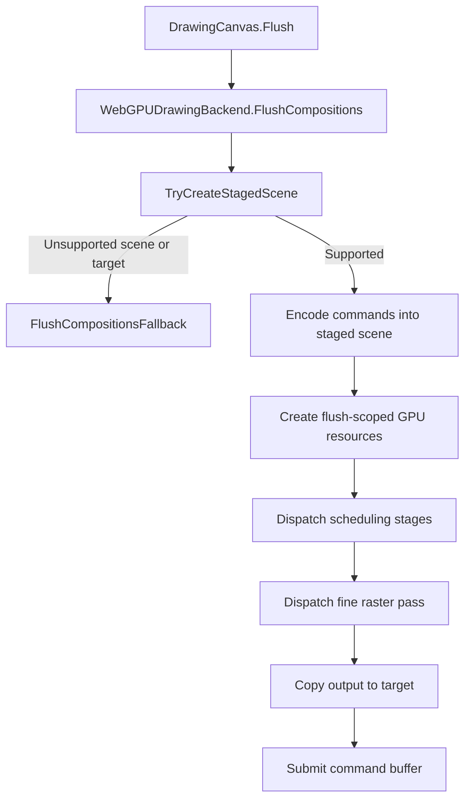
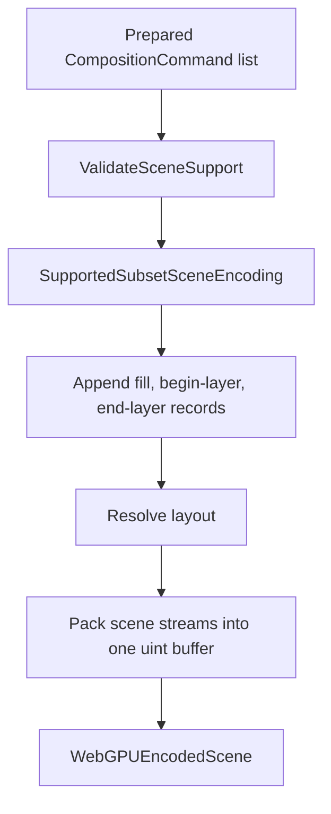
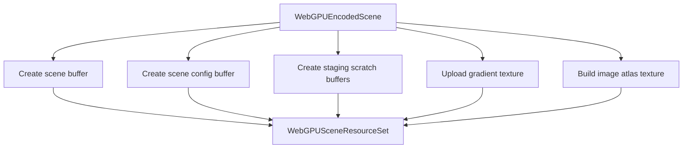
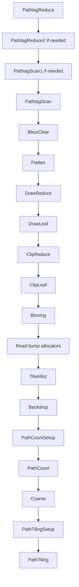
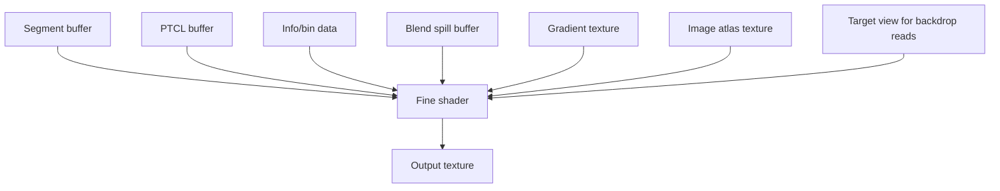
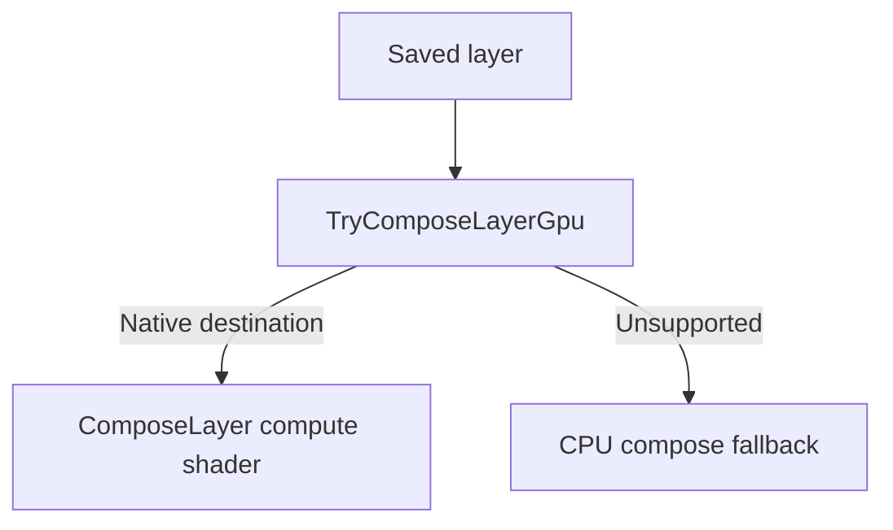

# WebGPU Backend Process

`WebGPUDrawingBackend` has two GPU responsibilities:

1. Run the staged scene rasterizer when the target surface, pixel format, and scene are supported.
2. Run GPU layer composition when a saved layer can be composited directly on a native WebGPU target.

This document describes the backend as a fixed system.

## Overview

The backend is organized around three major pieces:

- `WebGPUDrawingBackend` decides whether a flush can stay on the GPU or must fall back.
- `WebGPUSceneEncoder` turns prepared drawing commands into one staged scene payload.
- `WebGPUSceneDispatch` and `WebGPUSceneResources` turn that payload into flush-scoped GPU buffers, dispatch the staged pipeline, and submit the result.

At a high level, one scene flush looks like this:

## Entry Point

`FlushCompositions<TPixel>(...)` in [WebGPUDrawingBackend.cs](/d:/GitHub/SixLabors/ImageSharp.Drawing/src/ImageSharp.Drawing.WebGPU/WebGPUDrawingBackend.cs) is the top-level scene flush entry point.

Its job is deliberately narrow:

- clear the per-flush diagnostics
- try to build a staged WebGPU scene
- run the staged pipeline if scene creation succeeds
- fall back to `DefaultDrawingBackend` if any creation, validation, or dispatch step fails

That keeps fallback decisions at the boundary instead of discovering unsupported cases halfway through GPU execution.

## Stage 1: Scene Support Check

Before encoding begins, the backend performs a cheap scene-level support check in [WebGPUSceneEncoder.cs](/d:/GitHub/SixLabors/ImageSharp.Drawing/src/ImageSharp.Drawing.WebGPU/WebGPUSceneEncoder.cs).

`ValidateSceneSupport(...)` answers one question:

- can this whole flush run on the staged WebGPU path without mid-encode fallback?

That check is intentionally metadata-only. It validates:

- visible fill brush kinds
- flush-wide fine rasterization compatibility

It does not lower geometry or size GPU buffers. That keeps the check cheap and avoids doing the hot encoding work twice.

## Stage 2: Flush Context Creation

If the scene is eligible, `TryCreateStagedScene(...)` in [WebGPUSceneDispatch.cs](/d:/GitHub/SixLabors/ImageSharp.Drawing/src/ImageSharp.Drawing.WebGPU/WebGPUSceneDispatch.cs) creates a `WebGPUFlushContext`.

The flush context owns:

- the runtime lease
- device and queue references
- the target texture and target view
- the command encoder and optional compute pass encoder
- the tracked native resources created during the flush

The important lifetime rule is:

- everything in the staged scene path is flush-scoped unless it is explicitly cached in `WebGPURuntime.DeviceSharedState`

That keeps a flush as one isolated unit of work.

## Stage 3: Scene Encoding

The encoder in [WebGPUSceneEncoder.cs](/d:/GitHub/SixLabors/ImageSharp.Drawing/src/ImageSharp.Drawing.WebGPU/WebGPUSceneEncoder.cs) converts prepared commands into the packed scene format consumed by the WGSL pipeline.

The encoder writes several logical streams first:

- path tags
- path data
- draw tags
- draw data
- transforms
- styles
- gradient ramp pixels
- deferred image atlas descriptors

Those streams are then packed into one scene word buffer plus separate gradient/image payloads.

### Why The Encoder Is Structured This Way

The staged pipeline needs one packed scene layout because the GPU passes consume offsets into a single shared scene buffer. The encoder therefore separates:

- append-time construction of logical streams
- final packing into the GPU-facing layout

That split makes the encoded scene deterministic and keeps the shader contract explicit.

## Stage 4: Scene Planning

`WebGPUSceneConfig` in [WebGPUSceneConfig.cs](/d:/GitHub/SixLabors/ImageSharp.Drawing/src/ImageSharp.Drawing.WebGPU/WebGPUSceneConfig.cs) derives the dispatch counts and buffer sizes for one encoded scene.

It computes two things:

- `WebGPUSceneWorkgroupCounts`
- `WebGPUSceneBufferSizes`

Those values are still CPU-side planning data. They describe how much GPU work and scratch storage the current scene will require before any buffers are created.

## Stage 5: Binding Validation

Before dispatch, `TryValidateBindingSizes(...)` in [WebGPUSceneDispatch.cs](/d:/GitHub/SixLabors/ImageSharp.Drawing/src/ImageSharp.Drawing.WebGPU/WebGPUSceneDispatch.cs) checks the planned binding sizes against the storage-buffer binding limit.

This is not another semantic support check. It answers a different question:

- even if the scene is supported, can this specific encoded scene fit within the current WebGPU binding limits?

If not, the backend falls back before any resource creation or dispatch happens.

## Stage 6: Resource Creation

`WebGPUSceneResources.TryCreate(...)` in [WebGPUSceneResources.cs](/d:/GitHub/SixLabors/ImageSharp.Drawing/src/ImageSharp.Drawing.WebGPU/WebGPUSceneResources.cs) creates the flush-scoped GPU resources for the encoded scene.

This includes:

- the packed scene buffer
- the scene config buffer
- staging and scratch buffers used by the scheduling passes
- the gradient texture
- the image atlas texture

This stage creates many buffers because the staged pipeline models each logical scheduling resource separately.

## Stage 7: Scheduling Passes

The staged scene pipeline follows the same broad shape as the Vello-style scheduling pipeline it is based on.

`TryDispatchSchedulingStages(...)` in [WebGPUSceneDispatch.cs](/d:/GitHub/SixLabors/ImageSharp.Drawing/src/ImageSharp.Drawing.WebGPU/WebGPUSceneDispatch.cs) records and executes the earlier compute stages that transform the packed scene into tile-relative raster work.

The scheduling sequence is:

These passes do the scene-wide structural work:

- scan packed path and draw streams
- build path and clip metadata
- bin work into tiles
- count and allocate segment storage
- write tile-relative segment work for the fine pass

The result is not final pixels yet. It is the scheduled tile/segment data needed by the last raster stage.

## Stage 8: Fine Raster Pass

The final stage is dispatched by `TryDispatchFineArea(...)` in [WebGPUSceneDispatch.cs](/d:/GitHub/SixLabors/ImageSharp.Drawing/src/ImageSharp.Drawing.WebGPU/WebGPUSceneDispatch.cs).

Two fine shaders exist:

- `FineAreaComputeShader`
- `FineAliasedThresholdComputeShader`

Only one of them is chosen per flush.

That means the staged path supports:

- a fully antialiased flush
- or a fully aliased-threshold flush

It does not currently support mixed fine rasterization modes inside one flush.

The fine pass is where coverage is turned into final pixel writes.

## Stage 9: Copy And Submit

After the fine pass completes:

- the output texture is copied back to the target texture
- the command buffer is submitted

At that point the flush is complete and the flush-scoped resources can be released with the context.

## Fallback Path

If any stage fails, `FlushCompositionsFallback(...)` in [WebGPUDrawingBackend.cs](/d:/GitHub/SixLabors/ImageSharp.Drawing/src/ImageSharp.Drawing.WebGPU/WebGPUDrawingBackend.cs) runs the scene on `DefaultDrawingBackend` and uploads the result into the native target.

This fallback path is important because it covers:

- unsupported pixel formats
- unsupported scene features
- binding-limit failures
- resource-creation failures
- dispatch failures

The design goal is:

- decide as much as possible up front
- fall back cleanly
- never leave the flush half-executed across two backends

## Layer Composition

GPU layer composition is a separate path and is not part of the staged scene raster pipeline.

That path lives in:

- [WebGPUDrawingBackend.ComposeLayer.cs](/d:/GitHub/SixLabors/ImageSharp.Drawing/src/ImageSharp.Drawing.WebGPU/WebGPUDrawingBackend.ComposeLayer.cs)
- [ComposeLayerComputeShader.cs](/d:/GitHub/SixLabors/ImageSharp.Drawing/src/ImageSharp.Drawing.WebGPU/Shaders/ComposeLayerComputeShader.cs)

Its shape is much smaller:

This path is independent because it operates on already-rasterized pixel data rather than the full vector scene pipeline.

## Runtime And Caching

`WebGPURuntime` and `WebGPURuntime.DeviceSharedState` provide the process-scoped and device-scoped resources that should outlive a single flush.

They cache:

- device access
- composite pipelines
- composite compute pipelines
- some reusable shared buffers for device-scoped operations

Everything else in the staged scene path remains flush-scoped on purpose.

## Reading Order

If you want to understand the backend, read the files in this order:

1. [WebGPUDrawingBackend.cs](/d:/GitHub/SixLabors/ImageSharp.Drawing/src/ImageSharp.Drawing.WebGPU/WebGPUDrawingBackend.cs)
2. [WebGPUSceneEncoder.cs](/d:/GitHub/SixLabors/ImageSharp.Drawing/src/ImageSharp.Drawing.WebGPU/WebGPUSceneEncoder.cs)
3. [WebGPUSceneConfig.cs](/d:/GitHub/SixLabors/ImageSharp.Drawing/src/ImageSharp.Drawing.WebGPU/WebGPUSceneConfig.cs)
4. [WebGPUSceneResources.cs](/d:/GitHub/SixLabors/ImageSharp.Drawing/src/ImageSharp.Drawing.WebGPU/WebGPUSceneResources.cs)
5. [WebGPUSceneDispatch.cs](/d:/GitHub/SixLabors/ImageSharp.Drawing/src/ImageSharp.Drawing.WebGPU/WebGPUSceneDispatch.cs)
6. [WebGPUFlushContext.cs](/d:/GitHub/SixLabors/ImageSharp.Drawing/src/ImageSharp.Drawing.WebGPU/WebGPUFlushContext.cs)
7. [Shaders](/d:/GitHub/SixLabors/ImageSharp.Drawing/src/ImageSharp.Drawing.WebGPU/Shaders)
8. [WebGPUDrawingBackend.ComposeLayer.cs](/d:/GitHub/SixLabors/ImageSharp.Drawing/src/ImageSharp.Drawing.WebGPU/WebGPUDrawingBackend.ComposeLayer.cs)

## Summary

The backend has:

- a staged scene raster path
- a GPU layer composition path
- a CPU fallback path when the staged scene cannot run safely or legally

The central idea is simple:

- encode once per flush
- create flush-scoped resources
- run the staged scheduling pipeline
- run one scene-wide fine pass
- copy and submit
- otherwise fall back cleanly at the boundary
