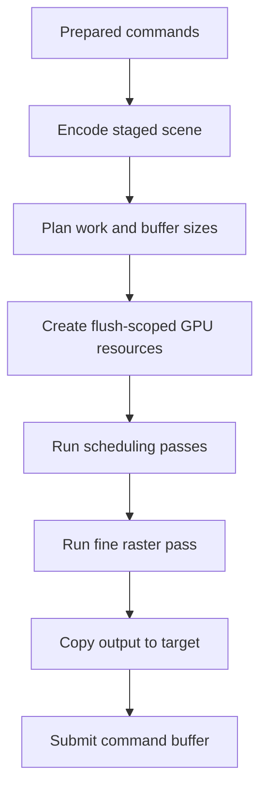
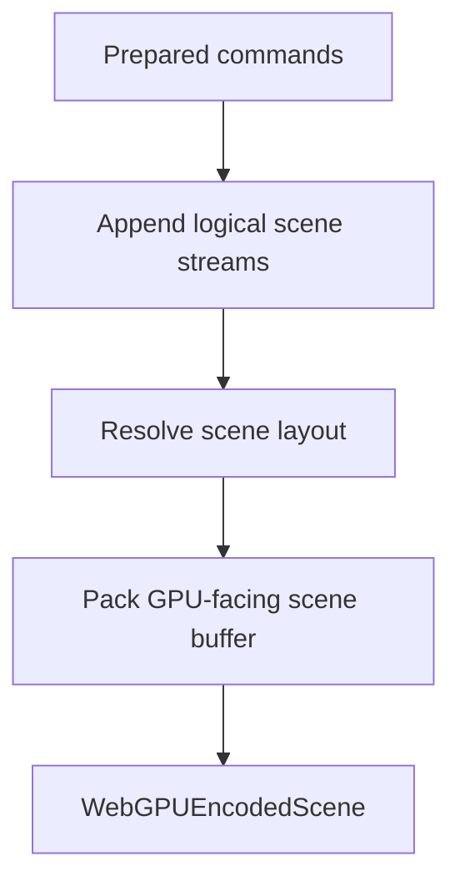
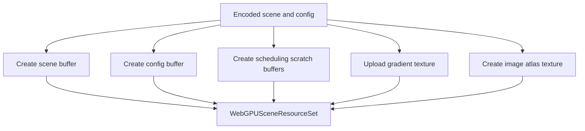
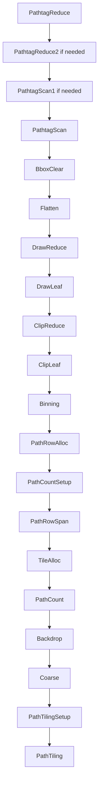

# WebGPU Rasterizer

This document describes the staged scene raster pipeline used by the WebGPU backend.

In this codebase, the WebGPU rasterizer is not a single type with one scan-conversion loop like the CPU `DefaultRasterizer`. It is the staged GPU pipeline formed by:

- `WebGPUSceneEncoder`
- `WebGPUSceneConfig`
- `WebGPUSceneResources`
- `WebGPUSceneDispatch`
- the WGSL shader set under `Shaders/WgslSource`

Together, these types turn one prepared flush into a staged GPU scene, schedule that scene into tile-relative work, run the fine raster pass, and write final pixels.

This document starts after two earlier boundaries have already been crossed:

- public WebGPU setup has already selected or created a native target through `WebGPUWindow`, `WebGPUExternalSurface`, `WebGPURenderTarget`, or `WebGPUNativeSurfaceFactory`
- `WebGPUDrawingBackend` has already decided that the flush should stay on the GPU path

Support probing through `WebGPUEnvironment` also sits outside this document. The rasterizer describes execution of one staged scene, not environment detection or object construction.

The staged GPU rasterizer is based on ideas and implementation techniques from Vello, but the current ImageSharp.Drawing implementation is heavily adapted and no longer mirrors Vello one-for-one:

- https://github.com/linebender/vello

## The Main Problem

A GPU backend does not want to discover work incrementally the way a CPU backend might.

The GPU path needs:

- one compact scene representation the shaders agree on
- explicit planning data before buffers are created
- explicit scratch resources for intermediate scheduling work
- a predictable pass order from encoded scene to final pixel writes

That is why the GPU path is staged. It does not try to paint commands directly. It encodes the flush into a GPU-friendly scene, runs scheduling passes that transform that scene into tile-relative work, and then runs a final fine pass that produces pixels.

## The Core Idea

The WebGPU rasterizer is a staged scene pipeline.

Its central idea is:

> encode one flush into a packed GPU scene, transform that scene through scheduling passes into tile-relative segment work, then run one fine raster pass that writes the final pixels

That split explains the major responsibilities:

- `WebGPUSceneEncoder` owns scene encoding
- `WebGPUSceneConfig` owns planning
- `WebGPUSceneResources` owns flush-scoped buffers and textures
- `WebGPUSceneDispatch` owns pass ordering and submission

## The Most Important Terms

### Encoded Scene

The encoded scene is the packed GPU-facing representation of one prepared flush.

It is not final pixels. It is the compact data the shaders will consume to derive those pixels.

### Config

`WebGPUSceneConfig` is the CPU-side planning description of the encoded scene.

It tells the rasterizer:

- how many workgroups are needed
- how large each scratch resource should be
- which chunk window should be used when oversized-scene chunking is active

### Resource Set

`WebGPUSceneResources` creates the flush-scoped buffers and textures used by the staged pipeline.

This includes:

- the packed scene buffer
- the config buffer
- the scheduling scratch buffers
- the gradient texture
- the image atlas texture

### Scheduling Passes

The scheduling passes are the earlier compute stages that transform the encoded scene into tile-relative raster work. Their output is not final pixels. Their output is the structured tile and segment data needed by the fine pass.

### Fine Pass

The fine pass is the final raster stage. It consumes the scheduled scene data and writes the output texture.

### Chunking

Chunking is the oversized-scene execution path used when one flush would otherwise exceed the device's single-binding limits for staged scene data such as `segments`.

The scene stays whole at encode time, but GPU consumption is windowed into chunk-local tile-row slices so the staged pipeline can stay within device limits.

## The Big Picture Flow

The easiest way to understand the rasterizer is to follow one staged scene from encoding to submission.

This flow has four major stages:

1. encode the scene
2. plan the GPU work
3. schedule the scene into tile-relative raster data
4. run the final fine pass

## Stage 1: Scene Encoding

`WebGPUSceneEncoder` converts prepared commands into the packed scene layout consumed by the WGSL pipeline.

The encoder first builds several logical streams such as:

- path tags
- path data
- draw tags
- draw data
- transforms
- styles
- gradient ramp pixels
- deferred image atlas descriptors

Those streams are then packed into the final scene word buffer plus separate gradient and image payloads.

Explicit layers are part of this encoding step too. `BeginLayer` and `EndLayer` stay in the prepared command stream until `WebGPUSceneEncoder` lowers them into `BeginClip` and `EndClip` draw records inside the encoded scene.

That split matters because the shaders consume offsets into one shared packed scene layout. The encoder therefore separates "append logical scene data" from "pack the final GPU-facing layout".

## Stage 2: Planning

`WebGPUSceneConfig` turns the encoded scene into planning data.

It computes:

- `WebGPUSceneWorkgroupCounts`
- `WebGPUSceneBufferSizes`
- chunk-window planning data when oversized-scene chunking is active

This stage is still CPU-side. It tells the rasterizer how much GPU work the current scene implies and how much scratch storage that work requires.

## Stage 3: Binding Validation

Before dispatch, `WebGPUSceneDispatch` validates the planned binding sizes against the current WebGPU limits.

This check answers:

"can the planned staged scene be bound legally on this device"

If not, the dispatch layer decides whether the scene:

- must fail back out to the backend
- or can be routed into the chunked oversized-scene path

This validation happens before the expensive dispatch work begins.

## Stage 4: Resource Creation

`WebGPUSceneResources.TryCreate(...)` creates the buffers and textures needed by the staged pipeline for the current flush.

That includes:

- the packed scene buffer
- the scene config buffer
- the scheduling scratch buffers
- the gradient texture
- the image atlas texture

The resource contents are flush-scoped, but the underlying allocations can be leased from backend-cached arenas and returned there after submission. That reuse keeps later flushes from recreating the same large GPU buffers when the current backend instance can keep reusing them safely.

## Stage 5: Scheduling Passes

The scheduling passes transform the packed scene into tile-relative raster work.

Their purpose is structural. They:

- scan the packed path and draw streams
- build path and clip metadata
- bin work into tiles
- allocate sparse per-path row metadata from clipped draw bounds
- discover each sparse row's active x span and carried backdrop
- allocate sparse path tiles only for the touched row spans
- count and allocate segment storage
- write the tile-relative segment work consumed by the fine pass

The result is not final pixels. It is the scene structure needed by the final raster stage.

## Stage 6: Fine Raster Pass

The fine pass is where the scheduled scene becomes final pixel writes.

Two fine shaders exist:

- `FineAreaComputeShader`
- `FineAliasedThresholdComputeShader`

Only one is selected for a flush.

The fine pass consumes data such as:

- the segment buffer
- the PTCL buffer
- info and bin data
- blend-spill storage
- gradient and image textures
- the target backdrop input

and writes the result into the output texture.

That is also where explicit layers are composited. The fine shader handles `BeginClip` and `EndClip` records inline by saving the current tile color, rendering the isolated layer contents, and then blending that isolated result back into the saved backdrop with the layer's stored blend mode and alpha.

## Stage 7: Copy And Submit

After the fine pass completes, the rasterizer copies the output texture to the target texture and submits the command buffer.

At that point the staged scene has completed and the per-flush resource contents can be discarded while any reusable arena allocations are returned to the backend cache.

## Chunked Oversized-Scene Execution

Some scenes exceed the device's single-binding limits even though they are otherwise valid staged scenes. Common examples are `segments`, `path rows`, or `path tiles` growing beyond the device's `MaxStorageBufferBindingSize`.

The chunked path exists for that case.

The important design point is that chunking does not re-clip or re-encode the scene on the CPU. The encoded scene remains whole. What changes is the GPU consumption window.

The dispatch layer executes the staged pipeline in chunk-local tile-row windows so each chunk stays within device limits while still using the same encoded scene.

That keeps the normal fast path unchanged and reserves chunking for the oversized path only.

## How The Rasterizer Stays Separate From The Backend

The staged rasterizer and the backend solve different problems.

The rasterizer decides:

- how one flush is encoded into a GPU scene
- how that scene is planned
- how the scheduling passes are recorded
- how the fine pass is dispatched

The backend decides:

- whether this flush can stay on the GPU
- how fallback works
- how flush-scoped work relates to runtime and device-scoped state

The public setup layer decides:

- how a caller acquires or owns the native target
- whether support should be probed explicitly through `WebGPUEnvironment`
- whether the caller is using a library-managed device or caller-owned native handles

That separation is why it helps to document them separately.

## Reading Guide

If you want to understand the staged rasterizer itself, read the code in this order:

1. `WebGPUSceneEncoder.cs`
2. `WebGPUSceneConfig.cs`
3. `WebGPUSceneResources.cs`
4. `WebGPUSceneDispatch.cs`
5. `Shaders`

That order mirrors the data lifecycle:

encoded scene -> planning -> resources -> staged execution -> shader contract

## The Mental Model To Keep

The easiest way to reason about the WebGPU rasterizer is this:

it is a staged scene pipeline. It encodes one prepared flush into a GPU-friendly scene, plans the work and scratch resources for that scene, transforms the scene through scheduling passes into tile-relative segment work, and runs one fine pass that writes the final pixels.

If that model is clear, the major types fall into place:

- `WebGPUSceneEncoder` encodes
- `WebGPUSceneConfig` plans
- `WebGPUSceneResources` creates flush-scoped resources
- `WebGPUSceneDispatch` records and submits the staged pipeline
