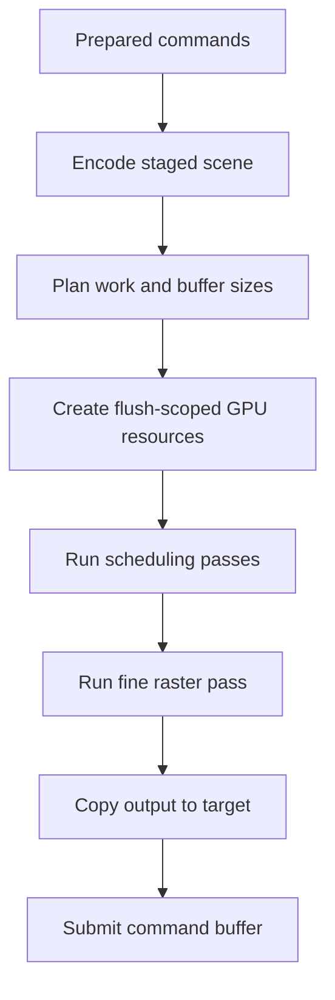
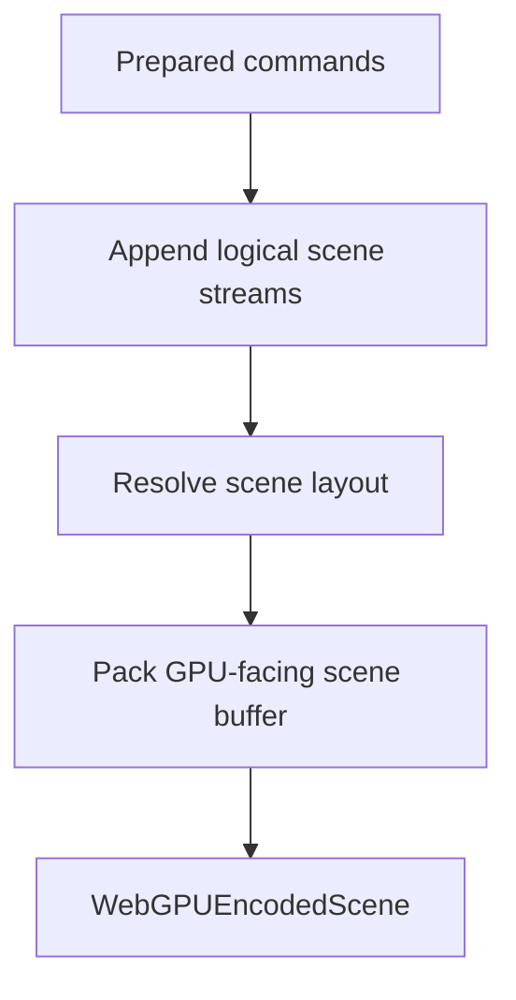
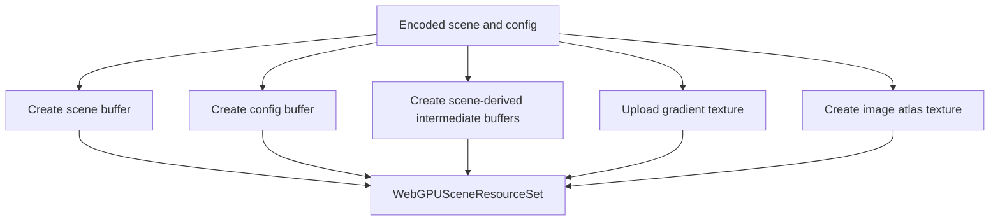
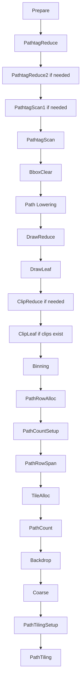

# WebGPU Rasterizer

This document describes the staged scene raster pipeline used by the WebGPU backend.

In this codebase, the WebGPU rasterizer is not a single type with one scan-conversion loop like the CPU `DefaultRasterizer`. It is the staged GPU pipeline formed by:

- `WebGPUSceneEncoder`
- `WebGPUSceneConfig`
- `WebGPUSceneResources`
- `WebGPUSceneDispatch`
- `GpuSceneDrawTag`, `GpuSceneDrawMonoid`, and the packed GPU scene structs
- the WGSL shader set under `Shaders/WgslSource`

Together, these types turn one retained encoded scene into staged GPU work, schedule that scene into tile-relative work, run the fine raster pass, and write final pixels.

This document starts after two earlier boundaries have already been crossed:

- public WebGPU setup has already selected or created a native target through `WebGPUWindow`, `WebGPUExternalSurface`, or `WebGPURenderTarget`
- `WebGPUDrawingBackend.RenderScene<TPixel>(...)` has already validated the typed native target

Support probing through `WebGPUEnvironment` also sits outside this document. The rasterizer describes execution of one staged scene, not environment detection or object construction.

The staged GPU rasterizer is based on ideas and implementation techniques from Vello, but the current ImageSharp.Drawing implementation is heavily adapted and no longer mirrors Vello one-for-one:

- https://github.com/linebender/vello

## The Main Problem

A GPU backend does not want to discover work incrementally the way a CPU backend might.

The GPU path needs:

- one compact scene representation the shaders agree on
- explicit planning data before buffers are created
- explicit scratch resources for intermediate scheduling work
- a predictable pass order from encoded scene to final pixel writes

That is why the GPU path is staged. It does not try to paint commands directly. It uses the retained encoded scene, runs scheduling passes that transform that scene into tile-relative work, and then runs a final fine pass that produces pixels.

## The Core Idea

The WebGPU rasterizer is a staged scene pipeline.

Its central idea is:

> stage one retained encoded scene, transform that scene through scheduling passes into tile-relative segment work, then run one fine raster pass that writes the final pixels

That split explains the major responsibilities:

- `WebGPUSceneEncoder` owns scene encoding
- `WebGPUSceneConfig` owns planning
- `WebGPUSceneResources` owns flush-scoped buffers and textures
- `WebGPUSceneDispatch` owns pass ordering and submission
- the `GpuScene*` format types own the CPU-side constants and structs that mirror WGSL scene layout

## The Most Important Terms

### Encoded Scene

The encoded scene is the packed GPU-facing representation of one prepared command batch.

It is not final pixels. It is the compact data the shaders will consume to derive those pixels.

### Config

`WebGPUSceneConfig` is the CPU-side planning description of the encoded scene.

It tells the rasterizer:

- how many workgroups are needed
- how large each scratch resource should be
- which chunk window should be used when oversized-scene chunking is active

### Resource Set

`WebGPUSceneResources` creates the flush-scoped buffers and textures used by the staged pipeline.

This includes:

- the packed scene buffer
- the config (header) buffer
- the scene-derived intermediate buffers (path monoids, path/draw/clip bboxes, draw monoids, the combined info/bin-data buffer, paths, lines)
- the gradient texture
- the image atlas texture, optionally sampling an external texture view (used by scoped-layer compositing)

The bump-allocated scheduling scratch (bin headers, path rows, path tiles, segment counts, segments, blend spill, PTCL, the bump buffer, and the status readback buffer) lives in a separate scheduling arena owned by the dispatch layer.

It does not own the draw-tag contract itself. `GpuSceneDrawTag` and `GpuSceneDrawMonoid` live in files named for those types. The remaining shader-visible record structs are still grouped in `WebGPUSceneResources.cs` near the resource set they back.

### Scheduling Passes

The scheduling passes are the earlier compute stages that transform the encoded scene into tile-relative raster work. Their output is not final pixels. Their output is the structured tile and segment data needed by the fine pass.

### Fine Pass

The fine pass is the final raster stage. It consumes the scheduled scene data and writes the output texture.

### Chunking

Chunking is the oversized-scene execution path used when one retained scene would otherwise exceed the device's single-binding limits for staged scene data such as `segments`.

The scene stays whole at encode time, but GPU consumption is windowed into chunk-local tile-row slices so the staged pipeline can stay within device limits.

## The Big Picture Flow

The easiest way to understand the rasterizer is to follow one staged scene from encoding to submission.

```mermaid
flowchart TD
    A[Prepared commands] --> B[Encode staged scene]
    B --> C[Plan work and buffer sizes]
    C --> D[Create flush-scoped GPU resources]
    D --> E[Run scheduling passes]
    E --> F[Run fine raster pass]
    F --> G[Copy output to target]
    G --> H[Submit command buffer]
```

This flow has four major stages:

1. encode the scene
2. plan the GPU work
3. schedule the scene into tile-relative raster data
4. run the final fine pass

## Stage 1: Scene Encoding

`WebGPUSceneEncoder` converts prepared commands into the packed scene layout consumed by the WGSL pipeline.

```mermaid
flowchart TD
    A[Prepared commands] --> B[Append logical scene streams]
    B --> C[Resolve scene layout]
    C --> D[Pack GPU-facing scene buffer]
    D --> E[WebGPUEncodedScene]
```

The encoder first builds several logical streams such as:

- path tags
- path data
- draw tags
- draw data
- transforms
- styles
- gradient ramp pixels
- path-gradient edge data
- deferred image atlas descriptors

Those streams are then packed into the final scene word buffer plus separate gradient and image payloads.

The draw-tag words and draw-info flag bits are defined by `GpuSceneDrawTag` and must match `Shaders/WgslSource/Shared/drawtag.wgsl`. The encoder chooses which tag or flag to write; the format type owns the numeric shader contract. The local clip bits (`CLIP_DIFFERENCE_MASK_BIT`, `CLIP_ISOLATED_MASK_BIT`) are declared once in `drawtag.wgsl` and set by the encoder in the high bits of the clip blend word.

Explicit layers are part of this encoding step too. `BeginLayer` and `EndLayer` stay in the prepared command stream until `WebGPUSceneEncoder` lowers them into `BeginClip` and `EndClip` draw records inside the encoded scene.

The stream split matters because the shaders consume offsets into one shared packed scene layout. The encoder therefore separates "append logical scene data" from "pack the final GPU-facing layout".

Three geometry rules the encoder applies matter downstream:

- the CPU pre-flattens fill geometry. The path-lowering stage transforms and emits only final fill lines. It does not subdivide fill curves
- the CPU does not expand stroke geometry. The encoder collapses micro-segments shorter than 1/64 px, matching the CPU stroker. Quad-to path tags carry stroke tangents, not curves. The GPU stroker in `path_lowering.wgsl` expands the stroke geometry
- clip paths carry a full-target raster interest rectangle. A clipped interest rectangle makes binning remove the clip coverage

Per-draw rasterization state is also encoded here: each visible fill carries its raster interest rectangle, and an aliased fill sets `DRAW_INFO_FLAGS_ALIASED_BIT` in its draw flags. Antialiased coverage data contains only the optional text coverage boost. Antialiased and aliased fills therefore coexist in one scene.

### Parallel Encoding

Large batches are planned and encoded in parallel over contiguous command-range partitions:

- a single sequential prescan (`CreatePartitionCommandRanges`) records, for each partition boundary, the stack of clip scopes opened by earlier partitions
- each partition replays those seed clips before its range and closes every open clip after it, so the concatenated partitions form one balanced clip stream and clipped scenes encode fully parallel
- layer scopes composite their contents as one group when they close, so a boundary may not cut through an open layer; boundaries snap forward to the next command index where the layer depth is zero, which can leave empty trailing partitions that simply encode nothing
- the partitions are concatenated by partition index, preserving timeline order

Batches containing Apply are encoded by `TryEncodeOrdered(...)` instead: Apply reads pixels back mid-scene, so those scenes encode sequentially into an ordered operation list (render ranges, Apply items, scoped layers) that the backend walks at render time. The backend document describes that model.

## Stage 2: Planning

`WebGPUSceneConfig` turns the encoded scene into planning data.

It computes:

- `WebGPUSceneWorkgroupCounts`
- `WebGPUSceneBufferSizes`
- chunk-window planning data when oversized-scene chunking is active

This stage is still CPU-side. It tells the rasterizer how much GPU work the current scene implies and how much scratch storage that work requires.

## Stage 3: Binding Validation

Before dispatch, `WebGPUSceneDispatch` validates the planned binding sizes against the current WebGPU limits.

This check answers:

"can the planned staged scene be bound legally on this device"

If not, the failure is classified by buffer (`BindingLimitBuffer`): overflows of the tile-dependent buffers (path rows, path tiles, segment counts, segments, blend spill, PTCL) route the scene into the chunked oversized-scene path, while any other failure fails the flush.

This validation happens before the expensive dispatch work begins.

## Stage 4: Resource Creation

`WebGPUSceneResources.TryCreate(...)` creates the buffers and textures needed by the staged pipeline for the current flush.

That includes:

- the packed scene buffer
- the scene config (header) buffer
- the scene-derived intermediate buffers
- the gradient texture
- the image atlas texture

```mermaid
flowchart TD
    A[Encoded scene and config] --> B[Create scene buffer]
    A --> C[Create config buffer]
    A --> D[Create scene-derived intermediate buffers]
    A --> E[Upload gradient texture]
    A --> F[Create image atlas texture]
    B --> G[WebGPUSceneResourceSet]
    C --> G
    D --> G
    E --> G
    F --> G
```

The bump-allocated scheduling scratch buffers are created separately by the dispatch layer's scheduling arena when the staged scene renders.

The resource contents are flush-scoped, but the underlying buffer allocations can be leased from backend-cached arenas and returned there after submission; the textures are scene-dependent and not pooled. That reuse keeps later flushes from recreating the same large GPU buffers when the current backend instance can keep reusing them safely.

## Stage 5: Scheduling Passes

The scheduling passes transform the packed scene into tile-relative raster work.

Their purpose is structural. They:

- reset the GPU bump allocators (prepare)
- scan the packed path and draw streams
- lower path segments into a device-space line soup, expanding strokes on the GPU
- build path and clip metadata
- bin work into tiles
- allocate sparse per-path row metadata from clipped draw bounds
- discover each sparse row's active x span and carried backdrop
- allocate sparse path tiles only for the touched row spans
- count and allocate segment storage
- write the tile-relative segment work consumed by the fine pass

The result is not final pixels. It is the scene structure needed by the final raster stage.

```mermaid
flowchart TD
    Z[Prepare] --> A[PathtagReduce]
    A --> B[PathtagReduce2 if needed]
    B --> C[PathtagScan1 if needed]
    C --> D[PathtagScan]
    D --> E[BboxClear]
    E --> F[Path Lowering]
    F --> G[DrawReduce]
    G --> H[DrawLeaf]
    H --> I[ClipReduce if needed]
    I --> J[ClipLeaf if clips exist]
    J --> K[Binning]
    K --> L[PathRowAlloc]
    L --> M[PathCountSetup]
    M --> N[PathRowSpan]
    N --> O[TileAlloc]
    O --> P[PathCount]
    P --> Q[Backdrop]
    Q --> R[Coarse]
    R --> S[PathTilingSetup]
    S --> T[PathTiling]
```

A few stage details worth knowing:

- `prepare.wgsl` binds only the bump buffer. It zeroes every bump-allocator counter and the failure mask on the GPU, and the pipeline never cancels mid-flush: all stages run so the counters report the true demand for every scratch buffer in a single pass
- the pathtag scan computes a prefix sum of a four-word `TagMonoid` (`trans_ix`, `pathseg_offset`, `style_ix`, `path_ix`) so path lowering can locate each segment's points, transform, and style in O(1)
- `bbox_clear` is dispatched over the scene's path count and resets each atomic path bbox to an inverted empty state before path lowering expands it
- `clip_reduce`/`clip_leaf` are skipped entirely when the scene has no clip records, and `clip_reduce` is skipped when the clip stream fits one 256-element partition

### Path Lowering: Fill Lines And GPU Stroking

`path_lowering.wgsl` converts encoded path segments into the device-space line soup consumed by the later stages, and it is where strokes become geometry.

For fills, the C# encoder supplies only final line segments. The shader reads each endpoint pair, applies the device transform, rejects zero-length results, and writes the line directly. This stage contains no curve subdivision or degree raising.

Stroke expansion diverges from upstream Vello. It is a direct port of the CPU `PolygonStroker`: `stroke_chain_point` walks the offset chain, `stroke_side_join` dispatches per-join handling, and `stroke_calc_miter` and `stroke_calc_arc` produce miters and round joins/caps. Caps, joins, and arcs are all generated on the GPU. The encoder supports this with two conventions: micro-segments shorter than 1/64 px are collapsed CPU-side before encoding (matching the CPU stroker's preprocessing), and quad-to path tags in a stroke are tangent markers for the stroker, not curve segments. Stroking never falls back to the CPU.

## Stage 6: Fine Raster Pass

The fine pass is where the scheduled scene becomes final pixel writes.

A single fine shader (`FineAreaComputeShader`) handles every flush; its pipeline is cached per
output texture format. Antialiased fills use analytic area coverage. Aliased fills walk sorted
crossings at pixel row and column centres. If a closed interval contains no centre, they light its
midpoint pixel unless the two boundary profiles show that the interval ends at a contour tip. A
second, vertical walk finds horizontal features between row centres. The aliased bit in
`CmdFill.size_and_rule` selects the coverage path. Each fill also carries a raster interest
rectangle; coverage outside it is zeroed.

For antialiased fills the `CmdFill.coverage_data` word carries the perceptual coverage boost
for text. Aliased fills leave that style value at zero because their command word is used for
tile-neighbour data. When non-zero, fine remaps partial coverage with the S-curve
`f(a) = a + boost * a * (1 - a) * (2a - 1)`, equivalently a blend
`(1 - boost) * a + boost * smoothstep(a)`: coverage above one half darkens and coverage below
it lightens, so stems solidify while counters stay bright. The remap is monotone and range
preserving, no pixel moves by more than `0.0962 * boost` coverage, and faint fringes keep at
least `(1 - boost)` of their value, which bounds erosion of sub-half-pixel features. Only text
fills carry a non-zero boost (`DrawingOptions.TextContrast`); plain vector fills, strokes, and
clips always encode zero. This matches the CPU rasterizer's `AreaToCoverage` boost; the full
derivation and the rationale versus Skia's mask-gamma remap live in
`ImageSharp.Drawing/Processing/DRAWING_CANVAS.md` under "The TextContrast curve".

The fine pass consumes data such as:

- the segment buffer
- the PTCL buffer
- the info stream (shared with bin data)
- blend-spill storage
- gradient and image atlas textures
- the backdrop texture holding the existing target contents

and writes the result into the output texture with straight (unpremultiplied) alpha.

The PTCL command set extends Vello's. Alongside the fill, color, gradient, image, clip, and
jump commands, the fine pass interprets `CMD_RECOLOR` (the `RecolorBrush`), `CMD_ELLIPTIC_GRAD`,
and `CMD_PATH_GRAD`. Brush evaluation is deliberately matched to the CPU brushes, including
gradient extend behavior; the recolor threshold is pre-transformed by the encoder
(`Threshold * 4`) into the shader's squared-color-distance domain so the shader compares
distances directly.

That is also where explicit layers are composited. The fine shader handles `BeginClip` and `EndClip` records inline by saving the current tile color, rendering the isolated layer contents, and then blending that isolated result back into the saved backdrop with the layer's stored blend mode and alpha. `CLIP_DIFFERENCE_MASK_BIT` inverts the clip coverage. Hard clips use the same aliased centre-sampling path as other aliased fills, so the clip pop consumes their binary mask directly.

## Stage 7: Readback, Copy, And Submit

Scheduling, fine, and the bump-allocator status readback are recorded into one command encoder and submitted together; mapping the readback buffer blocks until the GPU finishes.

The CPU then inspects the bump counters. If any allocator exceeded its capacity the fine output is discarded and the attempt reports the grown sizes back to the backend for a retry (see the next section). Otherwise the rasterizer copies the output texture to the target texture, submits the final copy, and reports the actual GPU usage so the caller can cache known-good sizes for later renders.

At that point the staged scene has completed and the per-flush resource contents can be discarded while any reusable arena allocations are returned to the backend cache.

## Scratch Overflow And Retry

The scratch buffers written by the scheduling passes (lines, binning, path rows, path tiles, segment counts, segments, blend spill, PTCL) are allocated by GPU bump allocators sized from cached estimates. The overflow protocol is:

- `prepare.wgsl` zeroes every bump counter and the failure mask at the start of each attempt and the pipeline never cancels: every stage runs and reports its true demand even after an overflow, so one readback can expose as much growth as possible
- an overflowing stage stops writing past its capacity but keeps counting, and sets the failure mask so the CPU knows the attempt's output is invalid
- the CPU readback detects the overflow and the backend retries the whole attempt with grown sizes
- earlier overflows can still hide later-stage demand, so the backend bounds the loop at roughly one failed pass per tracked allocator plus a safety margin

There is no CPU-side pre-validation of scratch capacities; the GPU counters are the single source of truth.

## Chunked Oversized-Scene Execution

Some scenes exceed the device's single-binding limits even though they are otherwise valid staged scenes. Common examples are `segments`, `path rows`, or `path tiles` growing beyond the device's `MaxStorageBufferBindingSize`.

The chunked path exists for that case.

The important design point is that chunking does not re-clip or re-encode the scene on the CPU. The encoded scene remains whole. What changes is the GPU consumption window.

The dispatch layer executes the staged pipeline in chunk-local tile-row windows so each chunk stays within device limits while still using the same encoded scene. The mechanics are:

- the output texture is seeded with the current target contents first, so pixels no chunk writes keep their original values when the full rectangle is copied back
- the chunk-invariant stages (prepare through binning) run exactly once per flush; each chunk then replays only the chunk-local stages, with `chunk_reset` clearing the chunk-local bump counters while preserving the shared path-lowering/binning state
- each chunk window is validated against the binding limits before dispatch; if a chunk's buffers still exceed the limit the window shrinks and validation repeats
- a chunk attempt that fails after passing binding validation fails the flush, because shrinking cannot cure it and retrying would re-record the identical chunk forever
- every chunk copies its bump-allocator status into a distinct offset of one readback buffer; all chunks are checked in a single batch readback at the end, and any overflow feeds the same grow-and-retry loop as the monolithic path
- the backend caches the largest successful chunk height per binding category and target size as an advisory first guess for later flushes

That keeps the normal fast path unchanged and reserves chunking for the oversized path only.

## How The Rasterizer Stays Separate From The Backend

The staged rasterizer and the backend solve different problems.

The rasterizer decides:

- how one retained scene is staged for GPU execution
- how that scene is planned
- how the scheduling passes are recorded
- how the fine pass is dispatched

The backend decides:

- how retained scene creation is separated from typed target rendering
- how the native target and `TPixel` requirements are validated at render time
- how flush-scoped work relates to runtime and device-scoped state

The public setup layer decides:

- how a caller acquires or owns the native target
- whether support should be probed explicitly through `WebGPUEnvironment`
- whether the caller is using a library-managed device or caller-owned native handles

That separation is why it helps to document them separately.

## Reading Guide

If you want to understand the staged rasterizer itself, read the code in this order:

1. `WebGPUSceneEncoder.cs`
2. `GpuSceneDrawTag.cs` and `GpuSceneDrawMonoid.cs`
3. `WebGPUSceneConfig.cs`
4. `WebGPUSceneResources.cs` for resource creation and the remaining packed GPU record structs
5. `WebGPUSceneDispatch.cs`
6. `Shaders`

That order mirrors the data lifecycle:

encoded scene -> draw-tag format -> planning -> resources and record layout -> staged execution -> WGSL

## The Mental Model To Keep

The easiest way to reason about the WebGPU rasterizer is this:

it is a staged scene pipeline. It stages one retained encoded scene, plans the work and scratch resources for that scene, transforms the scene through scheduling passes into tile-relative segment work, and runs one fine pass that writes the final pixels.

If that model is clear, the major types fall into place:

- `WebGPUSceneEncoder` encodes
- `GpuScene*` types define the packed CPU/WGSL scene contract
- `WebGPUSceneConfig` plans
- `WebGPUSceneResources` creates flush-scoped resources
- `WebGPUSceneDispatch` records and submits the staged pipeline
