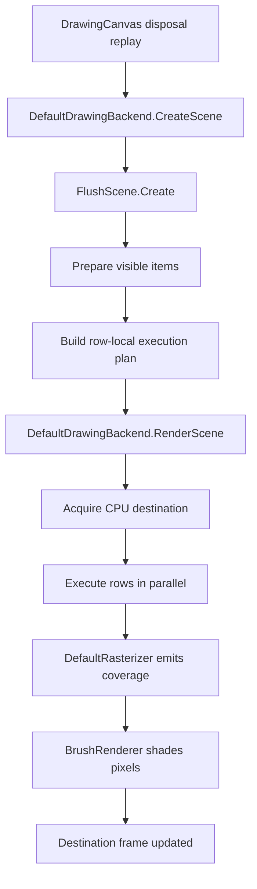
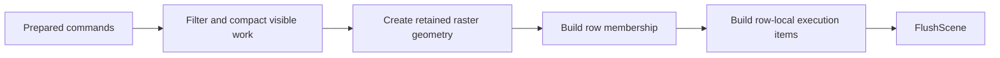
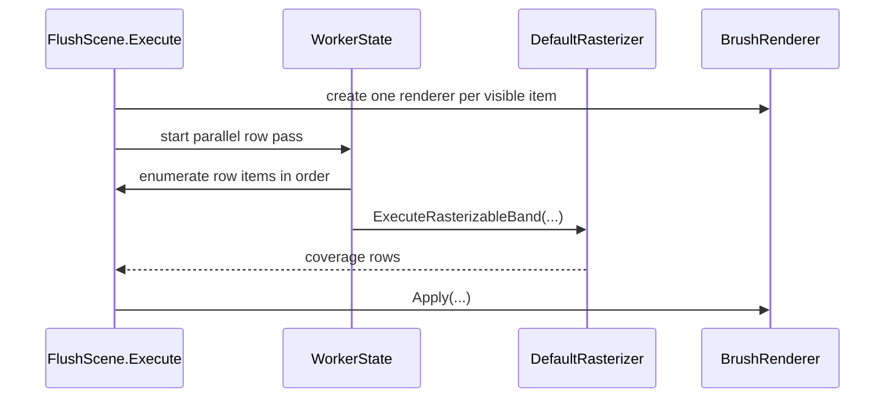
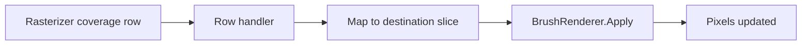

# DefaultDrawingBackend

`DefaultDrawingBackend` is the CPU execution backend for ImageSharp.Drawing. It creates retained CPU scenes from prepared drawing command batches, executes those scenes with reusable scratch, and writes the result into a CPU destination buffer.

This document explains the backend as a system rather than as a list of methods. The goal is to help a newcomer understand:

- where the CPU backend fits in the canvas/backend selection model
- what problem the CPU backend is solving
- why the backend is organized around a retained row-oriented execution plan
- what `FlushScene` means in this architecture
- how rasterization, brush application, and layer composition fit together

## Where The CPU Backend Fits

`DefaultDrawingBackend` is the standard CPU execution path behind `DrawingCanvas`.

The canvas architecture reaches this backend in two common ways:

- ordinary typed canvas construction resolves `IDrawingBackend` from `Configuration`
- specialized infrastructure can construct a canvas with an explicit backend instance

The CPU path usually uses the first route. The WebGPU helpers use the second route when they need a canvas that targets a native surface through `WebGPUDrawingBackend`.

That means the CPU backend is one backend implementation within the shared canvas architecture, not a separate public drawing model. It executes against any frame that exposes a writable CPU region, whether that frame is pure memory or a hybrid frame that also carries a native surface.

## The Main Problem

By the time work reaches `DefaultDrawingBackend`, the public drawing API has already been normalized into prepared commands. That is helpful, but it does not make CPU execution trivial.

The backend still has to solve a hard scheduling problem.

It needs to answer questions such as:

- which destination rows each command touches
- how to preserve draw order while running work in parallel
- how to avoid re-deriving geometry information in the hot loop
- where temporary memory should live and when it should be reused

If the CPU backend executed commands directly from the incoming scene, each worker would repeatedly rediscover which rows matter, which parts of the geometry matter in those rows, and how much scratch is needed. That would push expensive planning work into the hottest part of the pipeline.

So the backend takes a different approach:

it turns the whole command batch into a row-oriented execution plan first, then executes that plan.

That decision explains most of the backend architecture.

## The Core Idea

The CPU backend is a flush executor, not a command-at-a-time painter.

Its central idea is:

> convert a command batch into row-local raster work once, then execute rows directly with reusable worker-local scratch

That is why the backend is built around `FlushScene`.

`FlushScene` is a retained execution plan. In non-retained rendering it is short-lived and disposed after one replay entry; in retained rendering it can live with the returned `DefaultDrawingBackendScene`. Its job is to take a prepared command stream and reorganize it into a form that is cheap for the row executor to consume.

If that idea is clear, most of the important types fall into place.

## The Most Important Terms

### Backend

`DefaultDrawingBackend` is the top-level CPU executor. It owns backend policy and orchestration:

- acquiring a writable CPU destination
- creating the retained execution plan
- executing that plan
- handling CPU layer composition

It does not own every detail of geometry planning or scan conversion.

It also does not own backend selection. By the time `CreateScene(...)` or `RenderScene(...)` is called, the typed canvas implementation has already chosen the backend instance that will receive the prepared work.

### Scene

In the canvas architecture, the backend receives a `DrawingCommandBatch`. That batch already contains prepared commands and explicit layer boundaries for one contiguous command range.

For the CPU backend, that incoming batch is the starting point, not the final execution form.

### Flush Scene

`FlushScene` is the most important supporting type in the CPU backend.

In this codebase, `FlushScene` means:

"the retained, row-oriented execution plan for one CPU command batch"

It owns the retained information needed to make execution cheap:

- the visible prepared commands
- retained rasterizable geometry
- row membership
- row-local execution items
- scratch size requirements for the flush

### Rasterizer

`DefaultRasterizer` is the geometry-to-coverage engine.

It is responsible for:

- fixed-point scan conversion
- fill-rule handling
- coverage accumulation
- emitting row coverage spans

It is not responsible for deciding which commands should run in which rows, and it does not write final pixels directly.

### Brush Renderer

`BrushRenderer<TPixel>` is the coverage-to-color engine for one prepared drawing command.

It receives:

- a destination row slice
- coverage data
- destination position
- reusable workspace

and updates pixels accordingly.

The important separation is:

- the rasterizer decides coverage
- the brush renderer decides color
- the backend executor binds the two together

### Worker State

`WorkerState<TPixel>` is the reusable per-worker execution state.

It owns worker-local scratch such as:

- raster scratch
- brush workspace
- the coverage row handler state

This is how the backend avoids allocating fresh buffers for every row item during the hot parallel pass.

## The Big Picture Flow

The easiest way to understand the backend is to follow one command batch from scene creation to execution.

There are three major stages in that flow:

1. build the retained execution plan
2. establish the destination frame
3. execute rows using that plan

## What `DefaultDrawingBackend` Owns

`DefaultDrawingBackend` is intentionally smaller than its supporting types. It owns orchestration, not every low-level detail.

Its responsibilities are:

- create a `FlushScene`
- acquire a writable CPU region from the target frame
- execute that scene
- provide CPU layer composition services
- manage frame usage for CPU-backed targets

The expensive work is delegated:

- `FlushScene` owns retained row planning
- `DefaultRasterizer` owns scan conversion
- `BrushRenderer<TPixel>` owns brush-specific shading

That split keeps each type focused on one class of problem.

The canvas layer above that split is also important:

- `DrawingCanvas` records public drawing intent
- `DrawingCanvasBatcher<TPixel>` prepares commands and constructs `DrawingCommandBatch` values
- `DefaultDrawingBackend` executes the retained scene on a CPU destination

## Building The Flush Scene

`FlushScene.Create(...)` turns the prepared command stream into an execution plan in several phases. Each phase changes the data into a form that is cheaper for the next phase to consume.

### 1. Filter and compact visible work

The scene builder begins from the incoming command stream and keeps only the work that is visible and relevant to the flush. The later phases should not pay repeatedly for invisible commands through sparse scans or conditional branching.

### 2. Create retained raster geometry

For each visible item, the builder decomposes the command's drawing matrix into an X/Y scale and the rotation-shear-translation-perspective residual, asks the path for its scale-baked `LinearGeometry` via `ToLinearGeometry(Vector2 scale)`, and hands both the geometry and the residual to `DefaultRasterizer` to create the retained rasterizable payload. Curve subdivision therefore happens once per (path, scale) pair — cached on the `IPath` — and any per-frame rotation or translation rides into the rasterizer as the residual without forcing the path to re-flatten.

This step matters because it moves expensive geometry preparation out of the hot row loop and out of every frame of workloads like text or panning that drift only in their residual.

### 3. Build row membership

Once retained geometry exists, the scene builder determines which scene rows each item touches. That produces row-local membership information while preserving original submission order within every row.

That detail is critical. Parallel execution is allowed, but draw order must remain deterministic within each row.

### 4. Build row-local execution items

The scene then materializes the payload that the row executor will visit. Each row item points into flush-owned retained storage and carries just enough metadata to reconstruct a cheap `RasterizableBand` view when execution reaches that row.

At that point the scene is execution-ready.

## Why The Backend Is Row-First

The CPU backend executes rows, not commands.

This is one of the most important architectural choices in the whole path.

Why it helps:

- each worker naturally touches localized destination memory
- scratch can be reused across many row items
- draw order is straightforward inside a row
- geometry planning stays out of the hottest loop

A row-first executor fits the actual shape of CPU rendering much better than a command-first executor would.

## The Execution Pass

When `FlushScene.Execute(...)` runs, the backend prepares brush renderers and then executes scene rows in parallel.

There are two important ownership patterns in that pass:

- renderers are created once per visible item before the hot row loop
- scratch and workspace are reused per worker during the row loop

That is one of the backend's main performance properties.

## How Rasterization and Shading Stay Separate

The rasterizer and the backend solve different problems.

`DefaultRasterizer` is responsible for geometry and coverage.

`DefaultDrawingBackend` and `FlushScene` are responsible for:

- which items execute
- when they execute
- where their coverage belongs in the destination
- which brush renderer should consume that coverage

That separation is intentional. It lets the rasterizer stay geometry-focused while the backend handles composition and destination layout.

## Coverage Routing

The rasterizer does not write destination pixels directly. Instead it emits row coverage through a handler supplied by the backend.

The backend-side row handler:

- receives emitted coverage
- maps band-local coordinates back into destination coordinates
- slices the correct destination row
- invokes the correct `BrushRenderer<TPixel>`

This is why the brush renderer can stay target-unbound. It receives the destination row slice and coverage data at execution time rather than owning the destination frame itself.

## Layer Composition

CPU layer composition is a separate concern from path rasterization.

`ComposeLayer<TPixel>()` composites one CPU frame into another using `PixelBlender<TPixel>`. That path exists because compositing an already-rasterized layer is a different problem from scanning geometry into coverage.

Keeping those paths separate makes the backend easier to reason about.

## Frame And Memory Lifetime

The backend aligns ownership with the actual execution lifetime.

### Flush-owned

Owned by `FlushScene`:

- visible item arrays
- row structures
- retained raster data
- start-cover storage

Disposed when the flush ends.

### Worker-owned

Owned by `WorkerState<TPixel>` during execution:

- raster scratch
- brush workspace

Disposed when the worker completes.

### Item-owned

Created once per visible item during execution:

- `BrushRenderer<TPixel>`

Retained for the duration of the row pass and then released with the flush-owned scene item state.

That ownership model keeps allocation and disposal aligned with real work lifetime.

## Reading Guide

If you are new to this backend, read the code in this order:

1. `DrawingCanvas.cs`
2. `DrawingCanvas{TPixel}.cs`
3. `DrawingCanvasBatcher{TPixel}.cs`
4. `DefaultDrawingBackend.cs`
5. `FlushScene.cs`
6. `FlushScene.RetainedTypes.cs`
7. `DefaultDrawingBackend.Helpers.cs`
8. `DefaultRasterizer.cs`

That order mirrors the runtime flow:

canvas and backend selection -> backend orchestration -> retained row planning -> row execution structures -> worker helpers -> scan conversion

## The Mental Model To Keep

The easiest way to keep this backend straight is to remember that it is not a command-at-a-time painter. It is a flush executor that converts visible commands into row-local retained raster work and then executes that work with reusable scratch.

If that model is clear, the major types fall into place:

- `DrawingCanvas` records intent, and the typed implementation selects the backend
- `DefaultDrawingBackend` orchestrates
- `FlushScene` plans
- `DefaultRasterizer` converts geometry to coverage
- `BrushRenderer<TPixel>` converts coverage to color
