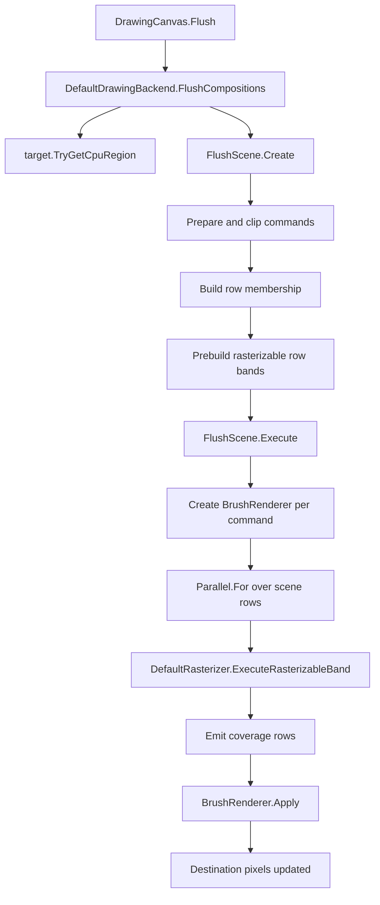
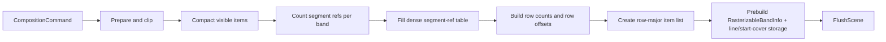

# DefaultDrawingBackend

`DefaultDrawingBackend` is the CPU drawing backend for ImageSharp.Drawing. It is responsible for taking a flush worth of prepared drawing commands, converting them into row-local raster work, and composing the resulting coverage into a CPU pixel buffer.

This document explains the current CPU backend:

- a flush-scoped `FlushScene`
- row-first execution
- row-local raster payloads
- reusable worker-local raster and brush scratch

The goal is to make the code readable as a system, not just as a collection of methods.

## 1. What The Backend Does

At a high level, the CPU backend has three jobs:

1. Accept a `CompositionScene` from `DrawingCanvas`.
2. Build a flush-scoped execution plan that is cheap to traverse in parallel.
3. Rasterize and compose that plan into a CPU destination frame.

`DefaultDrawingBackend` itself is intentionally small. Most of the real work lives in two places:

- `FlushScene.cs`
- `DefaultRasterizer.cs`

That split is deliberate:

- `DefaultDrawingBackend` owns backend policy.
- `FlushScene` owns flush-local scheduling and prepared row data.
- `DefaultRasterizer` owns scan conversion and coverage emission.

## 2. End-To-End Flow

The full CPU fill path looks like this:



There are two important ideas in that flow:

- the execution unit is a flush-scoped row scene, not a batch of commands sharing a coverage definition
- the rasterizer consumes row-local prepared data, not raw paths

## 3. DefaultDrawingBackend.cs

`DefaultDrawingBackend` is intentionally thin.

### `FlushCompositions`

`FlushCompositions<TPixel>()` does four things:

1. It returns immediately when there are no commands.
2. It asks the target for a CPU region.
3. It creates a `FlushScene` from the scene commands.
4. It executes that scene against the destination frame.

In other words, the backend delegates flush-local planning and execution to `FlushScene`.

### `ComposeLayer`

`ComposeLayer<TPixel>()` is separate from shape rasterization. It composites one CPU frame into another using `PixelBlender<TPixel>` and a reusable `amounts` buffer filled with `BlendPercentage`.

This is the backend's layer-composition path, not the path/shape fill path.

### `CreateLayerFrame`, `ReleaseFrameResources`, `TryReadRegion`

These methods are backend services:

- allocate a CPU frame
- release CPU-backed frame resources
- copy a region out of a CPU target

They are not part of the raster architecture, but they are part of the backend contract.

## 4. The Flush Scene

`FlushScene` is the real execution model for the CPU backend.

It exists only for the lifetime of one flush and owns:

- the visible prepared commands
- per-command row-band membership
- prebuilt row-local raster payloads
- row-major execution order
- scene-wide scratch size maxima

That means the expensive, shape-dependent preparation work happens once per flush, then execution can focus on scan conversion and composition.

### Why A Flush-Scoped Scene Exists

Without a flush scene, the backend would have to rediscover the same facts repeatedly:

- which rows a command touches
- which segments matter for a given row band
- how large worker scratch must be
- how to traverse commands in row order while preserving submission order

`FlushScene.Create()` centralizes that work.

## 5. FlushScene.Create In Detail

The builder runs in several phases. Each phase changes the shape of the data so the next phase can be cheaper.



### Phase 1: Prepare And Clip Commands

`FlushScene.Create()` calls `CompositionCommandPreparer.TryPrepareCommand(...)` for each command.

Despite the type name, in the CPU path this API is used as a command-normalization helper:

- reject invisible commands
- compute clipped destination region
- expose prepared geometry

This phase is embarrassingly parallel, so it runs across command ranges with `Parallel.ForEach`.

### Phase 2: Compact Visible Items

The preparation pass writes into fixed-size temporary arrays indexed by original command position. The next phase compacts only visible commands into dense arrays:

- `preparedCommands`
- `geometries`
- `rasterizerOptions`
- destination offsets
- band ranges

This matters because the execution path should not keep paying for invisible commands through sparse scans and conditional branches.

### Phase 3: Compute Scene-Wide Maxima

The scene computes:

- maximum item width
- maximum bit-vector width
- maximum cover stride
- maximum band capacity

Those values drive worker scratch sizing. Each worker can allocate once and reuse the same buffers for the whole flush.

### Phase 4: Count Segment References Per Band

For each visible geometry, the scene counts how many prepared line segments touch each local row band.

This is not rasterization yet. It is an indexing pass.

The important output is a dense offset table for:

- item -> local band -> segment reference range

Once that exists, later phases can read band membership directly from the dense offset table.

### Phase 5: Materialize Dense Segment References

The scene allocates one dense `int[]` of segment indices and fills it so each item's band range points into a contiguous slice of that array.

Conceptually:

```text
item 0
  band 0 -> segmentIndices[0..7)
  band 1 -> segmentIndices[7..11)

item 1
  band 0 -> segmentIndices[11..14)
```

This is the bridge from prepared geometry to row-local raster preparation.

### Phase 6: Build Row Membership

The scene converts item-local band ranges into scene-row counts, then into prefix-summed `rowOffsets`.

That produces a classic CSR-style row structure:

- `rowOffsets[row]`
- `rowOffsets[row + 1]`

Everything between those offsets belongs to that scene row.

### Phase 7: Build Row-Major Execution Order

The builder creates `PendingRowItem[]` in row-major order.

Each pending item records:

- which command it belongs to
- which local band it represents
- where its segment refs begin
- how many segment refs it owns
- the clipped destination region for that band

Submission order is preserved inside each row. That is critical because composition still has to respect draw order.

### Phase 8: Prebuild Rasterizable Bands

Finally, the scene allocates flush-owned storage for:

- `RasterLineData`
- start-cover seeds
- `RasterizableBandInfo`

Then it calls `DefaultRasterizer.TryBuildRasterizableBand(...)` once per row item.

This is where the scene becomes execution-ready. After this point, row execution can consume prebuilt line lists and left-of-band winding seeds directly.

## 6. What A Row Item Actually Contains

Each `RowItem` is small on purpose. It contains:

- `ItemIndex`
- `LineStart`
- `StartCoverStart`
- `DestinationRegion`

The item does not own its own arrays. Instead it points into large flush-owned buffers:

- one dense `RasterLineData` store
- one dense start-cover store

That layout reduces per-item allocation churn and keeps traversal cache-friendly.

## 7. Rasterizable Bands

The fill rasterizer operates on a row-local representation rather than on a general scene-wide edge table.

`RasterizableBandInfo` describes one band:

- line count
- band height
- width
- bit-vector width
- cover stride
- destination top
- fill rule
- raster mode
- antialias threshold
- whether the band has non-zero start covers

`RasterizableBand` is the execution view:

- `ReadOnlySpan<RasterLineData> Lines`
- `ReadOnlySpan<int> StartCovers`
- the raster metadata above

This separation matters:

- `RasterizableBandInfo` is storable
- `RasterizableBand` is a cheap span-based view built on demand

## 8. DefaultRasterizer: Fill Path

The fill rasterizer has two distinct steps:

1. build a rasterizable band
2. execute a rasterizable band

### 8.1 Band Building

`TryBuildRasterizableBand(...)` converts prepared line segments into row-local raster data.

For each candidate segment in the band:

1. translate from geometry space into interest-local coordinates
2. apply sampling origin offset
3. clip vertically to the band
4. convert to 24.8 fixed point
5. send left-of-visible-X coverage into start covers
6. clip visible portions horizontally to the band
7. emit a `RasterLineData` record for the visible part

The key idea is step 5.

Segments that begin left of the visible X range still affect winding. Instead of keeping those off-screen edges around forever, the builder folds their effect into `StartCovers`. Execution can then begin with the correct carry state and only process visible lines.

### 8.2 Band Execution

`ExecuteRasterizableBand(...)` is the hot scan-conversion entrypoint.

It does four things:

1. `Context.Reconfigure(...)`
2. `Context.SeedStartCovers(...)`
3. `Context.RasterizePreparedLines(...)`
4. `Context.EmitCoverageRows(...)`

Then it resets touched rows so the same scratch can be reused for the next band.

## 9. The Scanner Context

`DefaultRasterizer.Context` is the mutable fixed-point scanner state. It is a `ref struct` so the hot-path spans stay stack-bound.

The important buffers are:

- `bitVectors`: sparse touched-column tracking
- `coverArea`: winding delta and area accumulation
- `startCover`: left-of-band winding seeds
- `rowMinTouchedColumn` / `rowMaxTouchedColumn`: row-local sparse bounds
- `rowTouched` / `rowHasBits` / `touchedRows`: fast reset bookkeeping

Coverage emission works row-by-row:

1. find touched columns from the bit vectors
2. accumulate winding and area
3. resolve the fill rule
4. apply aliased or antialiased coverage conversion
5. coalesce spans
6. invoke the row callback

The fixed-point core is still the same coverage engine. What changed is the data shape feeding it.

## 10. Brush Composition

Rasterization emits coverage. It does not write colors directly.

Composition happens in `FlushScene.Execute()`:

1. create one `BrushRenderer<TPixel>` per command
2. run `Parallel.For` over scene rows
3. reuse one `WorkerScratch` and one `BrushWorkspace<TPixel>` per worker
4. for each row item:
   - build a span-based `RasterizableBand`
   - execute the raster band
   - route coverage rows into `ItemRowOperation.InvokeCoverageRow(...)`

`ItemRowOperation` maps emitted coverage back to the destination slice:

- convert `startX` to destination X using the command's interest left
- slice the destination row from `Buffer2DRegion<TPixel>`
- call `BrushRenderer.Apply(...)`

That means the rasterizer never needs to know about brushes, colors, gradients, or destination frame layout.

## 11. Why BrushRenderer Is Target-Unbound

`BrushRenderer<TPixel>` is target-unbound. Its `Apply(...)` method receives:

- `destinationRow`
- `coverage`
- `x`
- `y`
- `BrushWorkspace<TPixel>`

That separation is important for the row-first backend:

- renderers can be created once per command
- destination slicing is owned by the executor
- worker-local scratch can be reused across many brush applications

The renderer is now a row shader, not a row shader plus frame binding.

## 12. Stroke Rasterization

The standalone stroke API in `DefaultRasterizer` is still separate from the fill builder described above.

`RasterizeStrokeRows(...)`:

1. flattens contours
2. builds `StrokeEdgeData`
3. band-sorts those stroke descriptors
4. expands them into outline coverage during rasterization

This still uses the same fixed-point scan conversion context, but its input representation is different because strokes begin as centerlines that must be expanded into an outline.

That distinction is important:

- fill path: prepared geometry -> rasterizable row bands
- stroke path: centerline descriptors -> expanded outline coverage

## 13. Memory And Lifetime

The CPU backend deliberately aligns ownership with work lifetime.

### Flush-owned

Owned by `FlushScene`:

- command arrays
- row offsets
- row items
- dense line data
- dense start-cover data

Disposed when the flush ends.

### Worker-owned

Owned per worker during execution:

- `WorkerScratch`
- `BrushWorkspace<TPixel>`

Disposed when the worker completes.

### Command-owned

Owned per command during execution:

- `BrushRenderer<TPixel>`

Created once before row execution begins and disposed after the row pass finishes.

That ownership model keeps allocation and disposal aligned with the real execution lifetime of the work.

## 14. Other Backend Operations

Two backend operations are easy to overlook because they are not part of the raster path.

### `ComposeLayer`

This composites one frame into another using `PixelBlender<TPixel>`. It is used for layer flattening, not for path coverage rasterization.

### `TryReadRegion`

This copies a rectangular region out of a CPU target into a destination buffer. It is the backend's readback path.

## 15. Reading The Code In Order

If you want to understand the implementation in the same order the CPU backend executes it, read the files in this order:

1. `DefaultDrawingBackend.cs`
2. `FlushScene.cs`
3. `BrushRenderer.cs`
4. `DefaultRasterizer.cs`

Inside `DefaultRasterizer.cs`, read in this order:

1. `TryBuildRasterizableBand`
2. `ExecuteRasterizableBand`
3. `Context`
4. `WorkerScratch`

That order mirrors the real runtime path.

## 16. Summary

The current CPU backend is built around one core idea:

> convert a flush into row-local raster work once, then execute rows directly with reusable worker scratch

Everything else supports that idea:

- `FlushScene` turns commands into row-major work
- `RasterizableBandInfo` turns geometry into row-local raster data
- `Context` performs fixed-point scan conversion
- `BrushRenderer` composes coverage into pixels

That is the architecture to keep in mind when changing the backend or the rasterizer.
