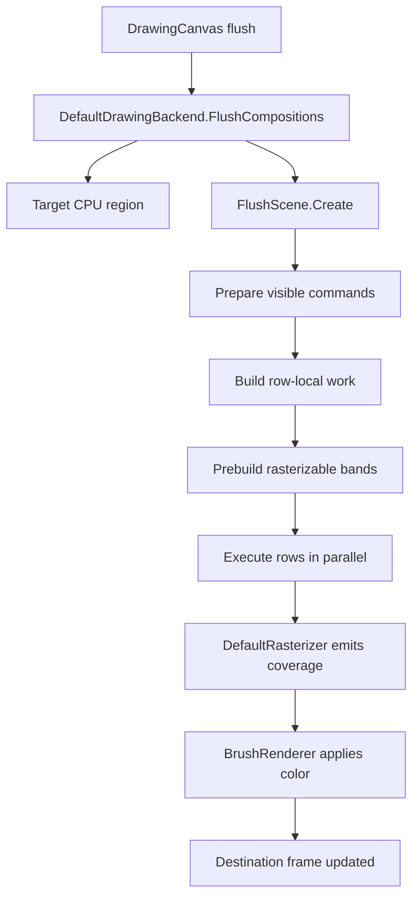
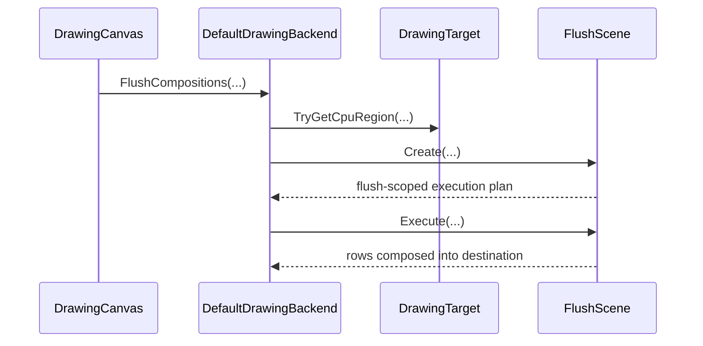
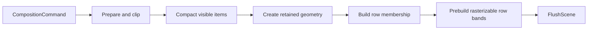
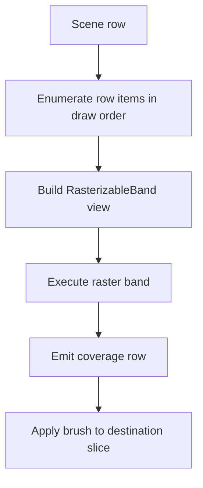
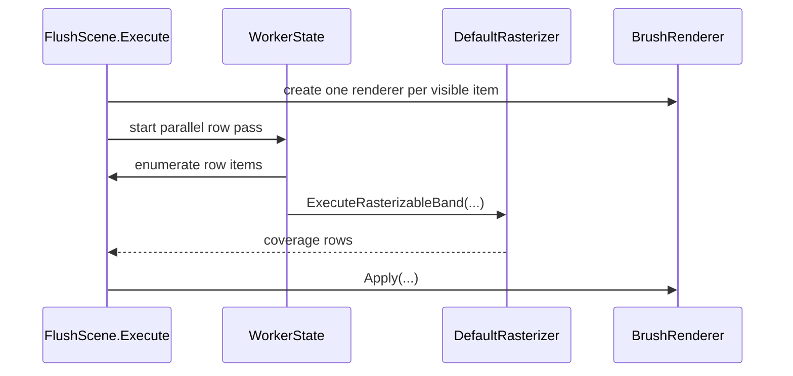
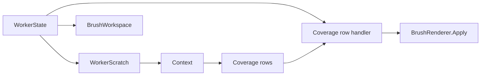
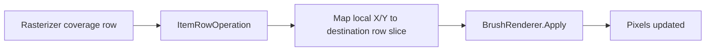

# `DefaultDrawingBackend`: The CPU Flush Executor

`DefaultDrawingBackend` is the CPU execution backend for ImageSharp.Drawing. It receives a flush worth of prepared drawing commands, turns them into row-local work, executes that work with reusable worker scratch, and composes the resulting coverage into a CPU destination buffer.

This document explains the current backend as an execution system rather than as a list of methods. The goal is to help a new reader understand:

- why a flush-scoped scene exists
- why work is arranged row-first instead of command-first
- how the rasterizer and brush renderer are kept separate
- where memory is owned and how it is reused

The current implementation spans these files:

- `src/ImageSharp.Drawing/Processing/Backends/DefaultDrawingBackend.cs`
- `src/ImageSharp.Drawing/Processing/Backends/DefaultDrawingBackend.Helpers.cs`
- `src/ImageSharp.Drawing/Processing/Backends/FlushScene.cs`
- `src/ImageSharp.Drawing/Processing/Backends/FlushScene.RetainedTypes.cs`
- `src/ImageSharp.Drawing/Processing/Backends/DefaultRasterizer.cs`

## The Backend's Core Idea

The backend is built around one simple idea:

> convert a flush into row-local raster work once, then execute rows directly with reusable worker-local scratch

That idea explains most of the architecture.

If the backend tried to execute directly from raw composition commands, each worker would need to repeatedly rediscover:

- which rows a command touches
- which geometry matters in a given row band
- how much raster scratch is needed
- how to preserve draw order while still running work in parallel

Instead, the backend creates a flush-scoped execution plan up front and uses that plan during the hot row pass.

## The Backend In One Diagram

There are three major stages in that flow:

1. establish the destination frame
2. build a flush-scoped scene
3. execute that scene row by row

## What `DefaultDrawingBackend` Owns

`DefaultDrawingBackend` is intentionally smaller than its supporting types. It owns backend policy and orchestration, not every detail of preparation or scan conversion.

Its responsibilities are:

- acquire a writable CPU destination
- create a flush scene
- execute that scene
- provide layer composition services
- manage frame lifecycle for CPU-backed targets

The expensive work is delegated:

- `FlushScene` owns flush-local planning
- `DefaultRasterizer` owns scan conversion
- `BrushRenderer<TPixel>` owns brush-specific composition

That split keeps the backend readable and limits how much one type needs to know at once.

## The Flush Path

The main fill path begins in `FlushCompositions<TPixel>()`.

At a high level, that method:

1. exits early if there is nothing to do
2. asks the target for a CPU region
3. builds a `FlushScene`
4. executes the scene into the region

That is intentionally compact because `FlushCompositions` is a coordinator, not the place where geometric or scan-conversion detail lives.

## Why `FlushScene` Exists

`FlushScene` is the most important supporting type in the CPU backend. It exists for one flush and is disposed when that flush finishes.

It owns the information needed to make row execution cheap:

- the visible prepared commands
- the retained rasterizable geometry for those commands
- the per-row list of items that must execute
- the maximum scratch requirements for the flush

Without a flush scene, row execution would need to reconstruct all of that every time a worker visited a row. That would make the hottest phase of the backend much more expensive.

## Building A Flush Scene

`FlushScene.Create(...)` turns a command stream into an execution plan in several phases. Each phase changes the data into a form that is cheaper for the next phase to consume.

### 1. Prepare And Clip Commands

The scene builder begins by asking `CompositionCommandPreparer` to normalize commands for CPU execution.

That phase:

- rejects invisible work
- computes clipped destination regions
- exposes prepared geometry and rasterizer options

This stage is data preparation. It is not yet rasterization.

### 2. Compact Visible Items

Preparation initially writes into temporary arrays indexed by original command position. The builder then compacts only visible work into dense flush-local arrays.

This matters because the rest of the pipeline should not repeatedly pay for invisible commands through sparse scans or conditional branches.

### 3. Create Retained Geometry

For each visible item, the builder asks `DefaultRasterizer` to create retained rasterizable geometry.

This is where arbitrary prepared shape data becomes:

- retained per-band line storage
- retained start-cover seeds
- compact geometry metadata that can be executed later without revisiting the original contour data

This step is one of the major reasons the current backend performs well on larger retained-fill workloads.

### 4. Build Row Membership

Once retained geometry exists, the scene builder determines which scene rows each item touches. That produces row-local membership information while preserving original submission order inside every row.

That detail is critical. Parallel execution is allowed, but draw order still must remain deterministic within each row.

### 5. Prebuild Rasterizable Bands

The scene then materializes the row-local execution payload. Each row item points into flush-owned retained storage and can later produce a cheap `RasterizableBand` view on demand.

At this point the scene is execution-ready.

## Row-First Execution

The backend executes rows, not commands.

This is one of the most important architectural choices in the CPU path. Brushes, destination slices, and scan-conversion scratch are all easier to manage when execution moves row-by-row through the destination.

Why this helps:

- each worker naturally touches localized destination memory
- raster scratch can be reused for many row items
- draw order is straightforward inside a row
- the rasterizer can stay geometry-focused while the executor handles destination layout

## Scene Rows And Row Items

Each scene row represents one vertical band of destination work.

Inside a row, work is stored as a sequence of row items. Each row item is intentionally small. It does not own large arrays. Instead it points into flush-owned retained storage and carries just enough metadata to reconstruct a `RasterizableBand`.

A row item answers questions like:

- which retained geometry does this band belong to
- where do its retained lines begin
- where do its start-cover seeds begin
- what destination region does this band map to

This keeps the execution path cache-friendly and avoids per-item allocation churn.

## The Execution Pass

When `FlushScene.Execute(...)` runs, the backend prepares command-scoped brush renderers and then executes rows in parallel.

The high-level execution flow looks like this:

There are two important ownership patterns here:

- renderers are created once per visible item before the row pass begins
- raster scratch and brush workspace are reused per worker during the row pass

That keeps setup work out of the hottest inner loop.

## `WorkerState<TPixel>` And Scratch Reuse

`WorkerState<TPixel>` bundles the reusable worker-local state needed during execution.

It owns:

- raster `WorkerScratch`
- `BrushWorkspace<TPixel>`
- the coverage row handler state used to route emitted coverage into the current destination row

This state is reused as a worker moves through scene rows. The backend therefore avoids allocating fresh scan-conversion buffers or brush workspace for every row item.

The reuse model is one of the backend's most important performance properties.

## How The Rasterizer And Backend Stay Separate

The backend and the rasterizer solve different problems.

`DefaultRasterizer` is responsible for:

- fixed-point scan conversion
- coverage accumulation
- fill-rule handling
- emitting row coverage spans

`DefaultDrawingBackend` and `FlushScene` are responsible for:

- which bands should execute
- how those bands map to destination rows
- which brush renderer should consume emitted coverage

That separation lets the same rasterizer stay focused on geometry while the backend deals with composition and target memory layout.

## Coverage Routing

The rasterizer does not write destination pixels directly. Instead it calls a row handler supplied by the backend.

The backend-side row handler:

- receives emitted row coverage
- converts band-local X coordinates back into destination coordinates
- slices the correct destination row
- invokes the correct `BrushRenderer<TPixel>`

This is why the brush renderer can stay target-unbound. It receives the destination row slice and coverage row at the moment of execution rather than owning a destination frame itself.

## Brush Renderers

A `BrushRenderer<TPixel>` represents the color-generation side of one visible drawing command.

It does not own row execution, and it does not discover geometry. It is created once for a command and then reused every time the executor needs to shade a coverage row belonging to that command.

That means the renderer acts like a row shader:

- input: destination row slice, coverage values, destination position, reusable workspace
- output: updated destination pixels

This makes the division of labor very clear:

- rasterizer decides coverage
- brush renderer decides color
- executor binds the two together

## Layer Composition Is Separate

`ComposeLayer<TPixel>()` is part of `DefaultDrawingBackend`, but it is not part of the polygon scanning path. It composites one CPU frame into another using `PixelBlender<TPixel>`.

That work is intentionally separate from path rasterization because it solves a different problem:

- shape fills and strokes produce coverage from geometry
- layer composition blends one finished frame into another

Keeping those paths separate makes the fill backend easier to reason about.

## Frame And Resource Lifetime

The backend aligns ownership with real execution lifetime.

### Flush-Owned

Owned by `FlushScene`:

- visible item arrays
- row structures
- retained raster data
- start-cover storage

Disposed when the flush ends.

### Worker-Owned

Owned by `WorkerState<TPixel>` during execution:

- raster scratch
- brush workspace

Disposed when the worker completes.

### Item-Owned

Created once per visible item during execution:

- `BrushRenderer<TPixel>`

Disposed after the row pass completes.

That ownership model is important because it keeps allocation and disposal aligned with the actual work lifetime.

## How To Read The Code

If you are new to this backend, read the code in this order:

1. `DefaultDrawingBackend.cs`
2. `FlushScene.cs`
3. `FlushScene.RetainedTypes.cs`
4. `DefaultDrawingBackend.Helpers.cs`
5. `DefaultRasterizer.cs`

That order mirrors the runtime flow:

- backend orchestration
- flush-scoped planning
- row-local retained structures
- worker execution state
- scan conversion

## The Mental Model To Keep

The easiest way to keep this backend straight is to remember that it is not a command-at-a-time painter. It is a flush executor that converts visible commands into row-local retained raster work and then executes that work with reusable scratch.

If that model is clear, the major types fall into place:

- `DefaultDrawingBackend` orchestrates
- `FlushScene` plans
- `DefaultRasterizer` converts geometry to coverage
- `BrushRenderer<TPixel>` converts coverage to color

That is the architecture the current CPU path is built around.
