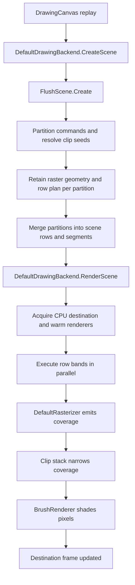
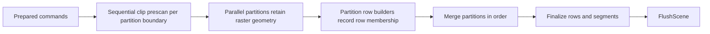
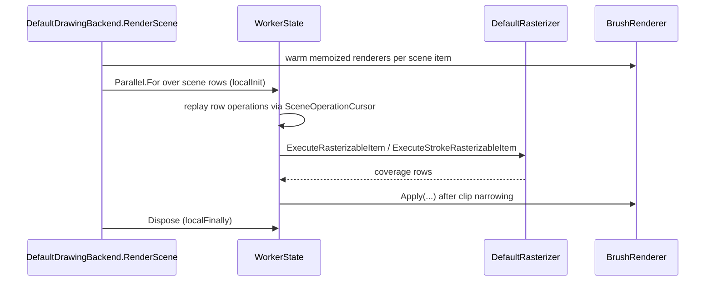
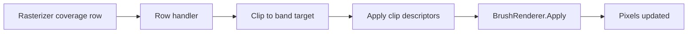

# DefaultDrawingBackend

`DefaultDrawingBackend` is the CPU execution backend for ImageSharp.Drawing. It creates retained CPU scenes from prepared drawing command batches, executes those scenes with reusable worker-local scratch, and writes the result into a CPU destination buffer.

This document explains the backend as a system rather than as a list of methods. The goal is to help a newcomer understand:

- where the CPU backend fits in the canvas/backend selection model
- what problem the CPU backend is solving
- why the backend is organized around a retained row-oriented execution plan
- what `FlushScene` means in this architecture
- how rasterization, clipping, brush application, and layer composition fit together

## Where The CPU Backend Fits

`DefaultDrawingBackend` is the standard CPU execution path behind `DrawingCanvas`.

The canvas architecture reaches this backend in two common ways:

- ordinary typed canvas construction resolves `IDrawingBackend` from `Configuration`
- specialized infrastructure can construct a canvas with an explicit backend instance

The CPU path usually uses the first route. The WebGPU helpers use the second route when they need a canvas that targets a native surface through `WebGPUDrawingBackend`.

That means the CPU backend is one backend implementation within the shared canvas architecture, not a separate public drawing model. It executes against any frame that exposes a writable CPU region, whether that frame is pure memory or a hybrid frame that also carries a native surface.

## The Main Problem

By the time work reaches `DefaultDrawingBackend`, the public drawing API has already been normalized into prepared commands. That is helpful, but it does not make CPU execution trivial.

The backend still has to solve a hard scheduling problem.

It needs to answer questions such as:

- which destination row bands each command touches
- how to preserve draw order while running work in parallel
- how to avoid re-deriving geometry information in the hot loop
- how clips recorded as ordered stream commands become per-item clip state without serializing scene creation
- where temporary memory should live and when it should be reused

If the CPU backend executed commands directly from the incoming scene, each worker would repeatedly rediscover which rows matter, which parts of the geometry matter in those rows, and how much scratch is needed. That would push expensive planning work into the hottest part of the pipeline.

So the backend takes a different approach:

it turns the whole command batch into a row-oriented execution plan first, then executes that plan.

That decision explains most of the backend architecture.

## The Core Idea

The CPU backend is a flush executor, not a command-at-a-time painter.

Its central idea is:

> convert a command batch into row-local raster work once, then execute row bands in parallel with reusable worker-local scratch

That is why the backend is built around `FlushScene`.

`FlushScene` is a retained execution plan. In non-retained rendering it is short-lived and disposed after one replay entry; in retained rendering it lives with the returned `DefaultDrawingBackendScene`. Its job is to take a prepared command stream and reorganize it into a form that is cheap for the row executor to consume. Execution itself lives in `DefaultDrawingBackend`, which walks the retained plan.

If that idea is clear, most of the important types fall into place.

## The Most Important Terms

### Backend

`DefaultDrawingBackend` is the top-level CPU executor. It owns backend policy and orchestration:

- acquiring a writable CPU destination
- creating the retained execution plan (`CreateScene`)
- executing that plan (`RenderScene`)
- handling CPU layer composition
- pixel copy and readback services (`CopyPixels`, `ReadRegion`, `ComposeLayer`)

It does not own every detail of geometry planning or scan conversion.

It also does not own backend selection. By the time `CreateScene(...)` or `RenderScene(...)` is called, the typed canvas implementation has already chosen the backend instance that will receive the prepared work.

### Scene

In the canvas architecture, the backend receives a `DrawingCommandBatch`. That batch already contains prepared commands plus explicit layer boundaries, clip scopes, and apply barriers for one contiguous command range, along with the `HasLayers`/`HasApply`/`HasClipControls` facts about the range.

For the CPU backend, that incoming batch is the starting point, not the final execution form. `CreateScene(...)` wraps the resulting `FlushScene` in a `DefaultDrawingBackendScene` so retained scenes can be re-rendered later.

### Flush Scene

`FlushScene` is the most important supporting type in the CPU backend.

In this codebase, `FlushScene` means:

"the retained, row-oriented execution plan for one CPU command batch"

It owns the retained information needed to make execution cheap:

- the retained fill and stroke scene items (`FillSceneItem`, `StrokeSceneItem`), each carrying its brush, graphics options, retained raster geometry, captured clip state, and destination offset
- retained layer state and, for scenes with apply barriers, control items
- the retained row lists (`SceneRow`), one per touched destination row band
- ordered target-wide segments (`SceneSegment`) when apply barriers or scoped layers split the scene

### Rasterizer

`DefaultRasterizer` is the geometry-to-coverage engine.

It is responsible for:

- fixed-point scan conversion of fills and strokes
- fill-rule handling
- coverage accumulation
- emitting row coverage spans

It is not responsible for deciding which commands should run in which rows, and it does not write final pixels directly.

### Brush Renderer

`BrushRenderer<TPixel>` is the coverage-to-color engine for one prepared drawing command.

It receives:

- a destination row slice
- coverage data
- destination position
- reusable workspace

and updates pixels accordingly.

The important separation is:

- the rasterizer decides coverage
- the brush renderer decides color
- the backend executor binds the two together

Renderers are memoized per scene item: `FillSceneItem.GetRenderer<TPixel>(...)` and `StrokeSceneItem.GetRenderer<TPixel>(...)` create the renderer on first use and cache it, and `RenderScene` warms every renderer before the parallel row pass so the hot loop never constructs one.

### Worker State

`WorkerState<TPixel>` is the reusable per-worker execution state.

It owns worker-local scratch such as:

- raster scratch (`DefaultRasterizer.WorkerScratch`)
- a second scratch reserved for path clip rasterization
- a reusable path clip coverage buffer
- the brush workspace

This is how the backend avoids allocating fresh buffers for every row item during the hot parallel pass. Each `Parallel.For` worker gets one instance through `localInit` and disposes it in `localFinally`.

## The Big Picture Flow

The easiest way to understand the backend is to follow one command batch from scene creation to execution.

```mermaid
flowchart TD
    A[DrawingCanvas replay] --> B[DefaultDrawingBackend.CreateScene]
    B --> C[FlushScene.Create]
    C --> D[Partition commands and resolve clip seeds]
    D --> E[Retain raster geometry and row plan per partition]
    E --> F[Merge partitions into scene rows and segments]
    F --> G[DefaultDrawingBackend.RenderScene]
    G --> H[Acquire CPU destination and warm renderers]
    H --> I[Execute row bands in parallel]
    I --> J[DefaultRasterizer emits coverage]
    J --> K[Clip stack narrows coverage]
    K --> L[BrushRenderer shades pixels]
    L --> M[Destination frame updated]
```

There are three major stages in that flow:

1. build the retained execution plan
2. establish the destination frame
3. execute row bands using that plan

## What `DefaultDrawingBackend` Owns

`DefaultDrawingBackend` is intentionally smaller than its supporting types. It owns orchestration, not every low-level detail.

Its responsibilities are:

- create a `FlushScene` and wrap it in a `DefaultDrawingBackendScene`
- acquire a writable CPU region from the target frame
- execute that scene
- provide CPU layer composition services
- provide pixel copy and readback for CPU-backed targets

The expensive work is delegated:

- `FlushScene` owns retained row planning
- `DefaultRasterizer` owns scan conversion
- `BrushRenderer<TPixel>` owns brush-specific shading

That split keeps each type focused on one class of problem.

The canvas layer above that split is also important:

- `DrawingCanvas` records public drawing intent
- `DrawingCanvasBatcher<TPixel>` prepares commands and constructs `DrawingCommandBatch` values
- `DefaultDrawingBackend` executes the retained scene on a CPU destination

## Building The Flush Scene

`FlushScene.Create(...)` turns the prepared command stream into an execution plan. Scene creation itself is parallel: the command range is split into contiguous partitions and prepared by a `Parallel.For`.

```mermaid
flowchart LR
    A[Prepared commands] --> B[Sequential clip prescan per partition boundary]
    B --> C[Parallel partitions retain raster geometry]
    C --> D[Partition row builders record row membership]
    D --> E[Merge partitions in order]
    E --> F[Finalize rows and segments]
    F --> G[FlushScene]
```

### 1. Resolve clip seeds at partition boundaries

The ordered begin/end-clip command stream is the single source of truth for clipping. Because partitions process disjoint command ranges in parallel, a single sequential prescan (`CreatePartitionClipSeeds`) walks the stream once and records, for each partition's first command, the clip scopes opened by earlier partitions. Each partition then seeds a `ClipStreamTracker` from that snapshot and tracks the stream independently, so preparation stays parallel without losing clip correctness.

### 2. Retain raster geometry per partition

Each partition (`ProcessPartition`) walks its command range in order. Clip commands only mutate the tracker; every draw command that follows captures the composed `DrawingClipState` and clip anchor from the tracker. For each visible fill or stroke, the builder decomposes the command's drawing matrix with `MatrixUtilities.GetScale` and `MatrixUtilities.GetResidual`, asks the path for its scale-baked `LinearGeometry` via `ToLinearGeometry(Vector2 scale)`, and hands the geometry plus the residual matrix to `DefaultRasterizer` to create the retained rasterizable payload. Curve subdivision therefore happens once per (path, scale) pair, cached on the `IPath`, and any per-frame rotation or translation rides into the rasterizer as the residual without forcing the path to re-flatten.

This step matters because it moves expensive geometry preparation out of the hot row loop and out of every frame of workloads like text or panning that drift only in their residual.

### 3. Build row membership

As each partition retains geometry, it appends row operations into partition-local row builders, one slot per destination row band. Partitions cover contiguous ascending command ranges, so merging their row builders in ascending partition order preserves painter's order within every row.

That detail is critical. Parallel scene creation is allowed, but draw order must remain deterministic within each row band.

### 4. Finalize rows and segments

The merged builders become `SceneRow` values, each pointing at a block chain of `SceneOperation` entries that reference flush-owned retained storage. When the batch contains apply barriers, the rows are additionally reorganized into ordered `SceneSegment` values so barriers execute at the right point; scoped layers (layers containing an apply) become `ScopedLayerSceneItem` segments of their own.

At that point the scene is execution-ready.

## Why The Backend Is Row-First

The CPU backend executes row bands, not commands.

A scene row is one horizontal band of the target, `DefaultRasterizer.DefaultTileHeight` (16) pixels tall, aligned to an absolute tile grid. Each `SceneRow` owns one disjoint band, so rows can execute in parallel with no synchronization: no two workers ever write the same destination pixel.

Why it helps:

- each worker naturally touches localized destination memory
- scratch can be reused across many row items
- draw order is straightforward inside a row
- geometry planning stays out of the hottest loop

A row-first executor fits the actual shape of CPU rendering much better than a command-first executor would.

## The Execution Pass

`RenderScene(...)` validates the target, acquires the CPU region, warms the memoized brush renderers, and then executes the plan.

If the scene has segments (apply barriers or scoped layers), `ExecuteSceneSegments` runs them strictly in order: the rows preceding a barrier must be complete before the barrier runs, because apply items read the pixels those rows produced and layer composition must observe everything drawn beneath the layer. Within each segment, rows still execute in parallel.

Otherwise `ExecuteSceneRows` runs one `Parallel.For` over the scene rows.

```mermaid
sequenceDiagram
    participant Render as DefaultDrawingBackend.RenderScene
    participant Worker as WorkerState
    participant Raster as DefaultRasterizer
    participant Brush as BrushRenderer

    Render->>Brush: warm memoized renderers per scene item
    Render->>Worker: Parallel.For over scene rows (localInit)
    Worker->>Worker: replay row operations via SceneOperationCursor
    Worker->>Raster: ExecuteRasterizableItem / ExecuteStrokeRasterizableItem
    Raster-->>Worker: coverage rows
    Worker->>Brush: Apply(...) after clip narrowing
    Render->>Worker: Dispose (localFinally)
```

Each row replays its operation stream through a `SceneOperationCursor`. The operations are `FillItem`, `StrokeItem`, `BeginLayer`, and `EndLayer`. Layer execution is recursive rather than stack-backed: `BeginLayer` allocates a clean temporary `BandTarget<TPixel>`, the nested call renders into it from the same cursor, and the band is blended back with the layer's graphics options when the scope ends.

There are two important ownership patterns in that pass:

- renderers are created once per scene item (memoized) and warmed before the hot row loop
- scratch and workspace are reused per worker during the row loop

That is one of the backend's main performance properties.

## How Rasterization and Shading Stay Separate

The rasterizer and the backend solve different problems.

`DefaultRasterizer` is responsible for geometry and coverage.

`DefaultDrawingBackend` and `FlushScene` are responsible for:

- which items execute
- when they execute
- where their coverage belongs in the destination
- which clips narrow that coverage
- which brush renderer should consume that coverage

That separation is intentional. It lets the rasterizer stay geometry-focused while the backend handles composition and destination layout.

## Coverage Routing And Clipping

The rasterizer does not write destination pixels directly. Instead it emits row coverage through a handler supplied by the backend.

The backend-side row handler, `FillCoverageRowHandler<TPixel>`:

- receives emitted coverage in absolute coordinates
- clips the span to the active band target and slices the correct destination row
- applies the retained clip stack captured with the scene item, recursively narrowing or scaling the span
- invokes the correct `BrushRenderer<TPixel>` with the surviving coverage

```mermaid
flowchart LR
    A[Rasterizer coverage row] --> B[Row handler]
    B --> C[Clip to band target]
    C --> D[Apply clip descriptors]
    D --> E[BrushRenderer.Apply]
    E --> F[Pixels updated]
```

Clip descriptors are applied by kind: rectangle clips narrow the span analytically, integer-region and region clips test rectangle membership, and path clips multiply the span by coverage rasterized from `PreparedPathClipState`, retained clip raster data built once per scene item at scene-creation time. Descriptors are recorded in canvas space and anchored through the item's destination offset so clips track the drawn geometry.

This is why the brush renderer can stay target-unbound. It receives the destination row slice and coverage data at execution time rather than owning the destination frame itself.

## Apply Barriers

An apply item runs a caller-supplied image processor over a path region as part of scene execution.

`ExecuteApplyItem`:

1. copies the covered target rectangle into a temporary `Image<TPixel>`
2. runs the recorded operation through `Mutate`
3. writes the processed pixels back through an `ImageBrush` driven by the apply item's retained coverage, in parallel over the item's row bands

Write-back uses Src semantics: the item's graphics options were cloned via `CloneForClearOperation` (Src alpha composition at full blend), so the processed pixels replace the covered region outright, including transparency, instead of blending over it. Rows preceding the barrier are guaranteed complete because segments execute in order.

## Layer Composition

CPU layer composition is a separate concern from path rasterization.

Inline layers composite band-by-band during row execution (`CompositeLayerBand`), and scoped layers composite as a whole after their segments finish (`CompositeLayerTarget`), both using `PixelBlender<TPixel>` with the layer's graphics options. Scoped composition partitions the overlap on the same absolute tile grid used for rendering so the parallel blend never shares a destination row between workers.

`ComposeLayer<TPixel>()` additionally exposes frame-to-frame composition using `PixelBlender<TPixel>` for callers outside scene execution. That path exists because compositing an already-rasterized layer is a different problem from scanning geometry into coverage.

Keeping those paths separate makes the backend easier to reason about.

## Frame And Memory Lifetime

The backend aligns ownership with the actual execution lifetime.

### Scene-owned

Owned by `FlushScene` (and therefore by the retained `DefaultDrawingBackendScene`):

- retained fill and stroke scene items, including their memoized renderers
- retained raster geometry and start-cover storage
- retained path clip raster data
- row and segment structures

Disposed when the scene is disposed; short-lived scenes are disposed after one replay entry.

### Worker-owned

Owned by `WorkerState<TPixel>` during execution:

- raster scratch and path-clip scratch
- path-clip coverage buffer
- brush workspace

Disposed when the worker completes (`localFinally`).

### Execution-scoped

Created during execution and released with it:

- temporary layer `BandTarget<TPixel>` buffers
- the temporary apply source image

That ownership model keeps allocation and disposal aligned with real work lifetime.

## Reading Guide

If you are new to this backend, read the code in this order:

1. `DrawingCanvas.cs`
2. `DrawingCanvas{TPixel}.cs`
3. `DrawingCanvasBatcher{TPixel}.cs`
4. `DefaultDrawingBackend.cs`
5. `FlushScene.cs`
6. `FlushScene.RetainedTypes.cs`
7. `DefaultDrawingBackend.Helpers.cs`
8. `DefaultRasterizer.cs`

That order mirrors the runtime flow:

canvas and backend selection -> backend orchestration -> retained row planning -> row execution structures -> worker helpers -> scan conversion

## The Mental Model To Keep

The easiest way to keep this backend straight is to remember that it is not a command-at-a-time painter. It is a flush executor that converts visible commands into row-local retained raster work and then executes that work in parallel with reusable scratch.

If that model is clear, the major types fall into place:

- `DrawingCanvas` records intent, and the typed implementation selects the backend
- `DefaultDrawingBackend` orchestrates
- `FlushScene` plans
- `DefaultRasterizer` converts geometry to coverage
- `BrushRenderer<TPixel>` converts coverage to color
