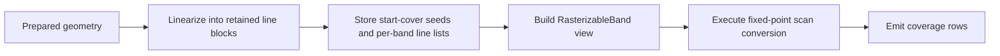
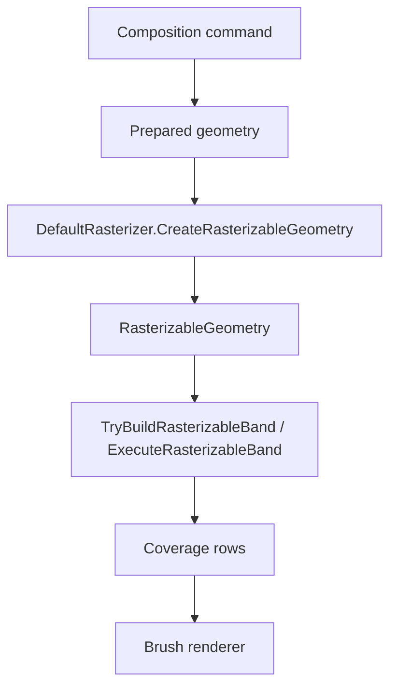
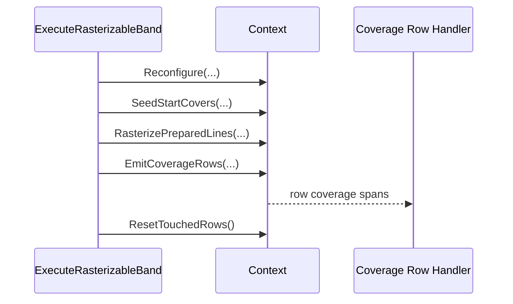
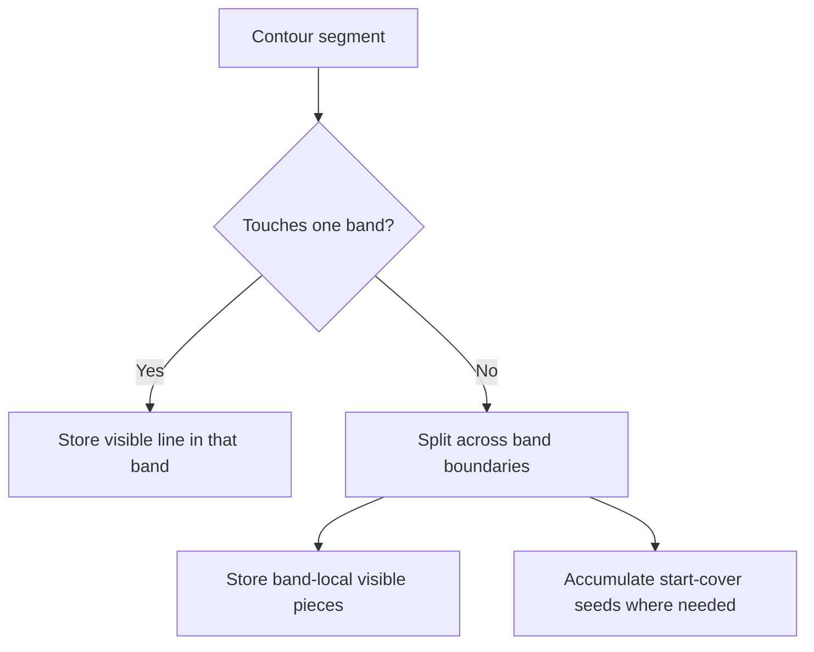
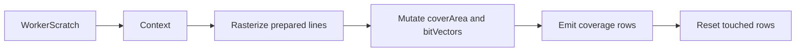
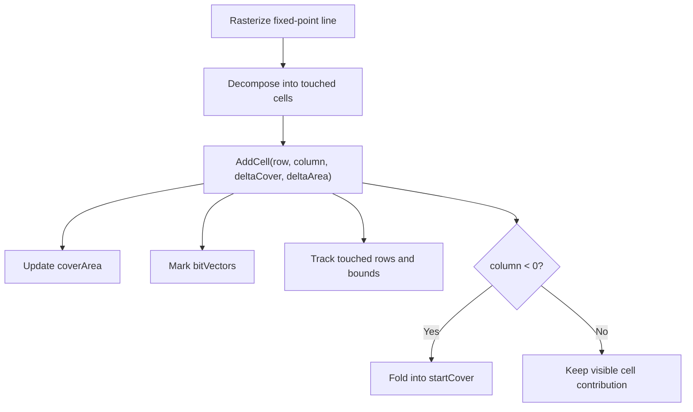
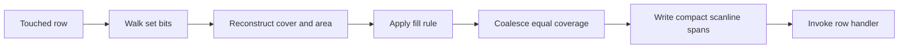

# Polygon Scanning In `DefaultRasterizer`

`DefaultRasterizer` is the CPU polygon scanner used by the retained fill backend in ImageSharp.Drawing. Its job is not to understand brushes, layers, or destination frames. Its job is narrower and more important: take already-prepared geometry, convert it into fixed-point edge contributions, and emit row coverage spans that the backend can compose into pixels.

This article explains how that scanner works today, why it is structured around retained row bands, and how the fixed-point coverage engine turns line segments into stable fill coverage.

The current implementation lives in:

- `src/ImageSharp.Drawing/Processing/Backends/DefaultRasterizer.cs`
- `src/ImageSharp.Drawing/Processing/Backends/DefaultRasterizer.Linearizer.cs`
- `src/ImageSharp.Drawing/Processing/Backends/DefaultRasterizer.Linearizer.Outputs.cs`
- `src/ImageSharp.Drawing/Processing/Backends/DefaultRasterizer.RetainedTypes.cs`
- `src/ImageSharp.Drawing/Processing/Backends/DefaultRasterizer.RasterizableGeometry.cs`

## Why This Scanner Exists

The retained fill backend does not rasterize directly from raw `IPath` commands during row execution. Doing that would force the executor to repeatedly rediscover the same geometry facts for every touched row band. Instead, the backend asks the rasterizer to do two separate kinds of work:

1. Build retained rasterizable geometry once.
2. Execute one prepared rasterizable band many times, cheaply.

That split is the core design choice. It keeps expensive geometry work out of the hottest row-composition loop and lets the execution phase focus on scan conversion and coverage emission.

## The Scanner's Input And Output

The scanner sits in the middle of the backend pipeline.

- Upstream, `FlushScene` and the geometry preparer decide which commands are visible and which geometry they contribute.
- Downstream, `DefaultDrawingBackend` uses emitted coverage rows to call `BrushRenderer<TPixel>.Apply(...)`.

The scanner therefore consumes geometry-centric data and emits coverage-centric data.

The important consequence is that the scanner has no knowledge of color sources. It never decides what a pixel should look like. It only decides how much geometric coverage each pixel receives.

## Coordinate System And Fixed-Point Precision

The scanner works in 24.8 fixed-point coordinates. Eight fractional bits give subpixel precision while keeping the inner loops integer-based.

- `1` pixel = `256` fixed-point units
- `FixedShift = 8`
- `FixedOne = 256`

This lets the scanner track fractional edge coverage without drifting into floating-point arithmetic in the hot path. Geometry may begin as floating-point path data, but once a retained line enters the scan-conversion core it is treated as integer fixed-point state.

Coverage is later converted into normalized `float` values in the range `[0, 1]` only at the emission boundary.

## The Two Major Scanner Phases

The retained fill path uses two scanner phases with very different responsibilities.

### Phase 1: Retained Geometry Building

`CreateRasterizableGeometry(...)` converts prepared geometry into a retained representation that is cheap to execute later. This phase uses the linearizers in `DefaultRasterizer.Linearizer.cs`.

The linearizer:

- walks the prepared contours
- converts them into fixed-point line segments
- splits or clips them as required by row-band boundaries
- records left-of-band winding influence into start-cover tables
- stores visible line segments into retained line blocks

The output is a `RasterizableGeometry` containing:

- clipped tile bounds
- per-band retained line arrays
- optional per-band start-cover seeds

### Phase 2: Band Execution

`ExecuteRasterizableBand(...)` is the hot execution entry point.

It does not rediscover geometry. Instead it receives a `RasterizableBand` view over already-retained data and performs the minimum work needed to emit coverage rows for that band.

That separation is why the scanner performs well on larger retained-fill workloads. The expensive topology work happens once; execution only consumes compact band-local data.

## Retained Geometry: What Gets Stored

The retained geometry model is built around per-band line storage.

`RasterizableGeometry` stores:

- the local bounds of the prepared shape
- band count and band-local metadata
- retained line arrays for each band
- optional start-cover arrays for bands that need left-of-band carry-in

The line arrays are specialized for two storage formats:

- `LineArrayX16Y16`
- `LineArrayX32Y16`

Those types are storage-oriented. They exist to retain compact fixed-point line segments so the runtime scan-conversion phase does not need to revisit the original contour data.

The line blocks currently use `NativeMemory` intentionally. This is a targeted exception in the retained-fill path, not a general policy for the rest of the backend. The retained line blocks are tiny and numerous, and larger retained-fill workloads benchmarked better when those blocks avoided the normal allocator path.

## Why Row Bands Exist

The scanner does not retain a single giant scene-wide edge table. It retains geometry in vertical row bands.

That choice matters because it bounds per-band work and makes downstream execution naturally row-oriented.

Each band represents a small vertical slice of the shape. When a segment crosses multiple bands, the linearizer splits it so each retained band contains only the line contributions relevant to that band.

This gives the backend several advantages:

- row execution only touches the band it is currently composing
- left-of-band winding can be precomputed into start-cover seeds
- scratch storage can be reused because band dimensions are bounded
- parallel row execution can consume compact band-local payloads

## The Linearizer

The linearizer is the retained-geometry builder. It is generic over the line-array storage type but the conceptual work is the same for both concrete variants.

Its responsibilities are:

- traverse prepared geometry contours
- clip work to the geometry's retained bounds
- convert coordinates into fixed-point
- decide whether a segment is fully contained or needs splitting
- store visible line pieces
- accumulate start covers for the parts of a segment that lie to the left of the visible band

For a new reader, the most important thing to understand is that the linearizer is not the hot coverage emitter. It is the preparation step that turns arbitrary contour geometry into a stable retained scanning payload.

### Contained Lines

A contained line is one whose fixed-point endpoints already fit the assumptions of the current retained geometry/band representation. Those lines can be pushed directly into retained line storage after the necessary fixed-point and band-boundary handling.

### Split Lines

When a line crosses band boundaries, the linearizer uses split logic so that each band receives only the portion it must scan. This is how the scanner avoids carrying giant scene-wide edge sets into execution.

### Start-Cover Seeding

When a line contributes winding to pixels inside the visible band but lies partially to the left of the visible X range, the retained geometry stores that influence in a start-cover array instead of keeping an off-screen line around forever.

That is one of the most important ideas in the retained design:

- visible geometry becomes retained lines
- invisible left-of-band winding becomes retained start-cover seeds

## The `Context` Ref Struct

`DefaultRasterizer.Context` is the mutable fixed-point scanner state used during band execution. It is a `ref struct` so its spans stay tied to worker-owned scratch and cannot accidentally escape the execution scope.

It owns the per-band mutable raster state:

- `bitVectors`
- `coverArea`
- `startCover`
- `rowMinTouchedColumn`
- `rowMaxTouchedColumn`
- `rowHasBits`
- `rowTouched`
- `touchedRows`

This state is reused across bands by reconfiguration, not by reallocation.

The `Context` has four public execution-stage responsibilities:

- `Reconfigure(...)`
- `SeedStartCovers(...)`
- `RasterizeLineSegment(...)` and line iteration helpers
- `EmitCoverageRows(...)`

Together they bridge retained geometry and per-row coverage emission.

## How The Scanner Accumulates Coverage

The scanner uses the classic area/cover formulation.

When a fixed-point line is rasterized, it is broken into cell contributions. Those contributions end up in `AddCell(...)`, which updates two pieces of per-cell state:

- delta cover
- delta area

Rows also track sparse touched-column information through bit vectors so the emitter can avoid scanning the full width of empty rows.

This is the core reason the scanner can honor fill rules after the fact. It does not need pre-normalized polygon topology. It integrates winding/area contributions first and applies the fill rule during emission.

## Coverage Emission

`EmitCoverageRows(...)` converts the accumulated integer coverage state into row spans.

For each touched row, the emitter:

1. starts from the seeded `startCover`
2. walks the row's touched columns using the bit vectors
3. updates the running cover from `deltaCover`
4. combines running cover and `deltaArea` into signed area
5. converts signed area into normalized coverage using the fill rule
6. coalesces equal-coverage runs
7. materializes only non-zero spans into the reusable `scanline`
8. invokes the row callback

The scanner therefore emits only rows that actually received contributions and only the non-zero runs within those rows.

## Fill Rules

The scanner supports both `NonZero` and `EvenOdd`.

### `NonZero`

The accumulated signed area is treated as winding magnitude. Coverage is the clamped absolute value of that area.

### `EvenOdd`

The accumulated area is wrapped into the even-odd domain before coverage is produced. This gives parity-based behavior without changing the earlier scan-conversion logic.

The fill rule is therefore an emission-time decision, not a geometry-preprocessing decision.

## Antialiased And Aliased Modes

The scanner can emit either continuous or thresholded coverage.

- `Antialiased` mode keeps the continuous coverage generated by the area/cover math.
- `Aliased` mode thresholds that continuous coverage using `AntialiasThreshold`.

This is important because the scan-conversion core stays the same in both modes. Only the final conversion from area to emitted coverage changes.

## Why Self-Intersections Work

The scanner can handle self-intersections because it does not require geometric boolean normalization before rasterization. It accumulates signed contributions and then applies the selected fill rule during emission.

That means overlapping or self-crossing contours are resolved by:

- area/cover integration
- winding or parity mapping

instead of by an earlier polygon-boolean pass.

## Practical Performance Characteristics

The current scanner favors retained preparation and cheap repeated execution.

The major performance ideas are:

- build retained geometry once
- execute compact band-local line lists
- reuse worker-owned scratch
- skip untouched rows through explicit tracking
- walk only touched columns via bit vectors
- fold off-screen left-of-band influence into start-cover seeds

For larger retained-fill workloads, the current retained line-block storage and row-band model substantially reduce execution work compared with rediscovering geometry during row composition.

## How To Read The Code

If you are new to this part of the library, read the scanner in this order:

1. `CreateRasterizableGeometry(...)` in `DefaultRasterizer.cs`
2. `Linearizer<TL>` and the concrete linearizers in `DefaultRasterizer.Linearizer.cs`
3. retained line types in `DefaultRasterizer.RetainedTypes.cs`
4. `ExecuteRasterizableBand(...)` in `DefaultRasterizer.cs`
5. `Context` in `DefaultRasterizer.cs`

That order mirrors the real lifecycle of the data:

- geometry preparation
- retained storage
- band execution
- coverage emission

## Closing Mental Model

The easiest way to reason about `DefaultRasterizer` is this:

> it is a retained fixed-point polygon scanner that transforms prepared geometry into compact band-local line payloads, then turns those payloads into row coverage spans

If that model stays clear, the rest of the code becomes easier to read:

- the linearizer explains where retained line data comes from
- the retained line arrays explain how it is stored
- the `Context` explains how it becomes coverage
- the backend explains how that coverage becomes pixels
