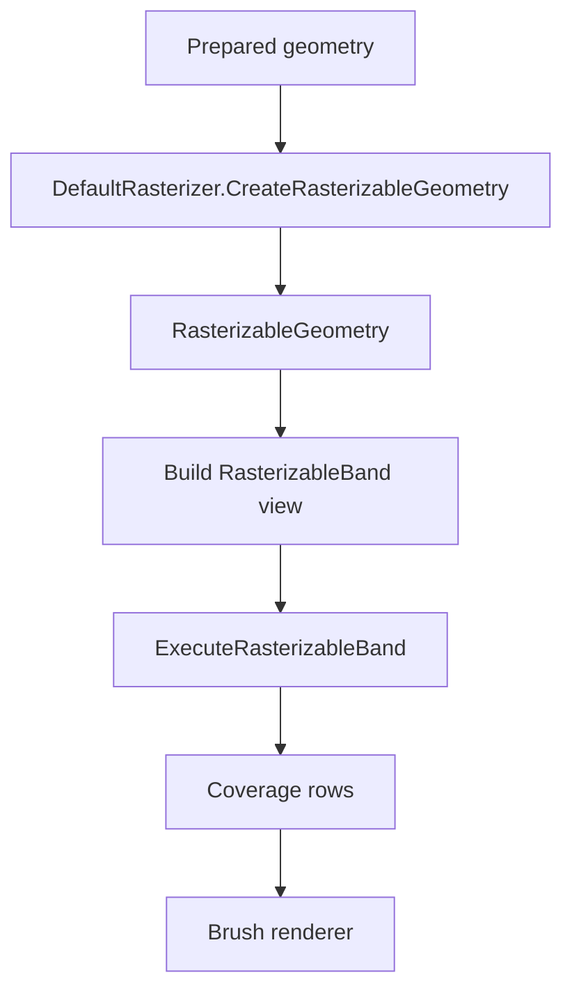
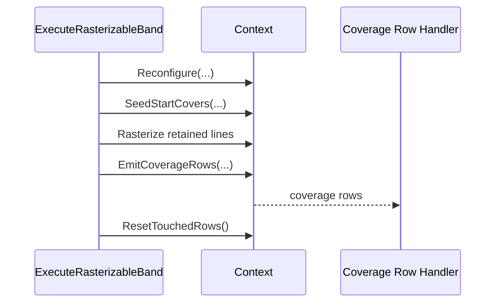
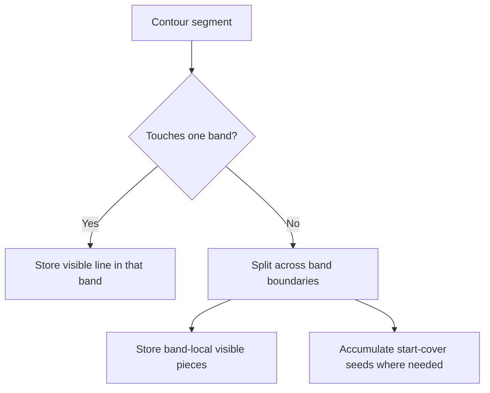
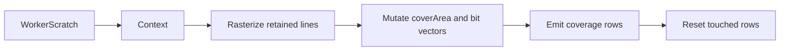
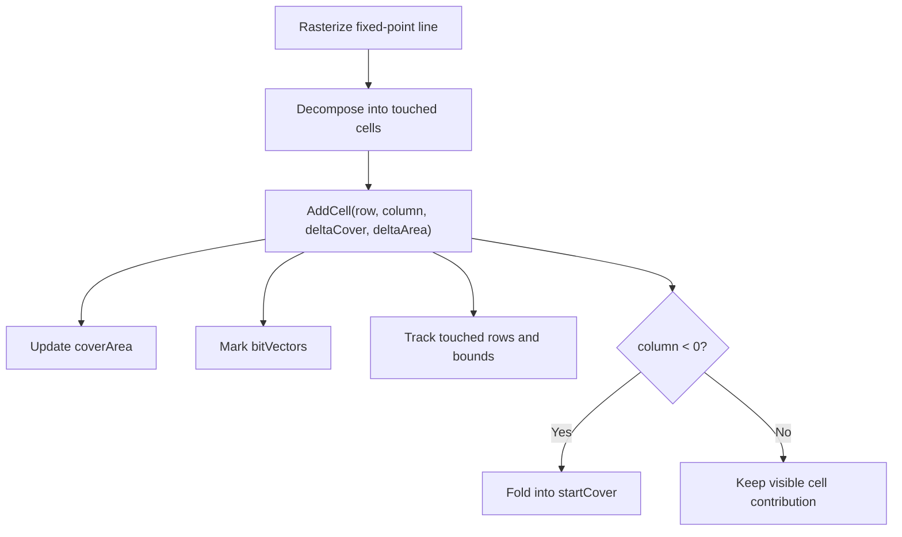
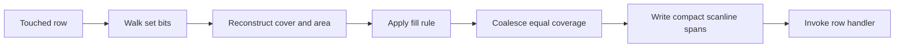

# DefaultRasterizer

`DefaultRasterizer` is the CPU polygon scanner used by the retained fill path in ImageSharp.Drawing. Its job is narrow but central: take already-prepared geometry, convert that geometry into fixed-point edge contributions, and emit coverage rows that the CPU backend can turn into pixels.

This rasterizer is based on ideas and implementation techniques from the Blaze project:

- https://github.com/aurimasg/blaze

This document explains the rasterizer as a newcomer needs to understand it:

- what problem the rasterizer is solving inside the CPU backend
- why the rasterizer is split into retained geometry building and band execution
- what retained geometry, bands, and coverage mean in this architecture
- how scan conversion stays separate from brush shading and frame ownership

## The Main Problem

The CPU backend does not want to rediscover shape geometry every time it touches a destination row.

If row execution had to start from raw prepared paths every time, the backend would repeatedly need to:

- walk contours
- split segments against row-band boundaries
- compute left-of-band winding influence
- rebuild scan-conversion state for the same shape over and over

That would push expensive geometry work into the hottest part of CPU rendering.

So the rasterizer solves a different problem:

it builds retained rasterizable geometry once, then executes compact band-local scanning work many times, cheaply.

That two-phase design is the core idea behind `DefaultRasterizer`.

## The Core Idea

The rasterizer is a retained fixed-point polygon scanner.

Its central idea is:

> build band-local retained line data once, then execute fixed-point scan conversion from that retained data

This is why the rasterizer has two very different modes of work:

1. retained geometry building
2. band execution

The first phase is a preparation phase. The second is the hot execution phase.

If that distinction is clear, the code becomes much easier to follow.

## The Most Important Terms

### Rasterizer

`DefaultRasterizer` is the geometry-to-coverage engine.

It is responsible for:

- converting prepared geometry into retained scan-conversion data
- rasterizing retained band data with fixed-point arithmetic
- emitting coverage rows

It is not responsible for:

- brush color generation
- destination frame ownership
- layer composition
- deciding which scene items should execute

Those problems belong to the CPU backend and `FlushScene`.

### Retained Geometry

Retained geometry is the rasterizer's prepared execution payload.

In this codebase, retained geometry means:

"the fixed-point, band-local line data and start-cover seeds needed to rasterize one prepared shape later without revisiting its original contour data"

That retained form is stored in `RasterizableGeometry`.

### Band

A band is one small vertical slice of a shape's retained geometry.

The rasterizer does not keep one giant scene-wide edge table. It stores data in row bands so execution can stay local and bounded.

### Rasterizable Geometry

`RasterizableGeometry` is the retained representation of one prepared shape.

It stores:

- clipped local bounds
- band-local metadata
- retained line arrays
- optional start-cover seeds for bands that need carry-in winding

This is the retained object that the CPU backend keeps in `FlushScene`.

### Rasterizable Band

A `RasterizableBand` is the execution-time view over one retained band of one retained shape.

It is the immediate input to `ExecuteRasterizableBand(...)`.

### Context

`DefaultRasterizer.Context` is the mutable fixed-point scanning state used during band execution.

It is a `ref struct` because it is tied directly to worker-owned scratch spans and should not escape the execution scope.

### Coverage

Coverage is the rasterizer's output.

The rasterizer does not decide final pixel colors. It decides how much geometric coverage each pixel receives. The backend later passes that coverage to a `BrushRenderer<TPixel>`, which decides how the destination pixels should be shaded.

## Where The Rasterizer Fits

The rasterizer sits in the middle of the CPU backend pipeline.

Upstream:

- `CompositionCommand` preparation produces prepared geometry
- `FlushScene` decides which items are visible and when they execute

Downstream:

- the rasterizer emits row coverage
- `DefaultDrawingBackend` routes that coverage into `BrushRenderer<TPixel>.Apply(...)`

That placement is important. The rasterizer is neither the public drawing model nor the final shading model. It is the geometry-to-coverage step between them.

## Why The Rasterizer Has Two Phases

The rasterizer separates:

1. building retained geometry
2. executing retained geometry

### Phase 1: retained geometry building

`CreateRasterizableGeometry(...)` converts prepared geometry into a retained representation that is cheap to execute later.

This phase:

- walks prepared contours
- converts coordinates into fixed-point
- clips or splits segments as needed for band boundaries
- records visible line pieces into retained line storage
- records left-of-band winding influence into start-cover tables

The output is `RasterizableGeometry`.

### Phase 2: band execution

`ExecuteRasterizableBand(...)` is the hot execution entry point.

It does not revisit the original contour data. It receives a `RasterizableBand` view over retained data and performs the minimum work needed to emit coverage rows for that band.

That separation is one of the key reasons the retained fill path performs well. Expensive geometry work happens once; execution consumes compact band-local data.

## Fixed-Point Precision

The rasterizer works in 24.8 fixed-point coordinates.

That means:

- `1` pixel = `256` fixed-point units
- `FixedShift = 8`
- `FixedOne = 256`

This gives the scanner subpixel precision while keeping the hot execution path integer-based. Geometry may begin as floating-point path data, but once a retained line reaches the scan-conversion core it is treated as fixed-point state.

Coverage is converted back into normalized `float` values only at the emission boundary.

## Why Bands Exist

The rasterizer does not retain one monolithic edge table. It retains geometry in vertical row bands.

That matters because it keeps execution local and bounded.

When a segment crosses multiple bands, the linearizer splits it so each band receives only the portion it must scan. If a segment influences winding inside the visible band from the left side, that influence is folded into a start-cover seed rather than keeping an invisible off-screen line around forever.

This gives the backend several important properties:

- execution only touches the band it is currently composing
- left-of-band winding can be precomputed
- scratch requirements stay bounded
- row-oriented execution consumes compact band-local payloads

## Retained Geometry: What Gets Stored

`RasterizableGeometry` stores the retained data needed to rasterize a prepared shape later.

That includes:

- the local bounds of the prepared shape
- band count and band-local metadata
- retained line arrays for each band
- optional start-cover arrays for bands that need carry-in winding

The retained line arrays use specialized storage formats such as:

- `LineArrayX16Y16`
- `LineArrayX32Y16`

These are storage-oriented types. They exist to retain compact fixed-point line segments so execution does not need to revisit contour data.

## The Linearizer

The linearizer is the retained-geometry builder. It is generic over line-array storage, but the conceptual work is the same across variants.

Its responsibilities are:

- traverse prepared contours
- clip work to retained bounds
- convert coordinates into fixed-point
- decide whether a segment is contained or must be split
- store visible line pieces
- accumulate start covers for left-of-band influence

For a newcomer, the most important thing to understand is that the linearizer is not the hot coverage emitter. It is the preparation step that turns arbitrary contour geometry into a stable retained scanning payload.

### Contained lines

A contained line is one whose fixed-point endpoints already fit the assumptions of the current retained band representation. Those lines can be pushed directly into retained storage after the required fixed-point and band-boundary handling.

### Split lines

When a line crosses band boundaries, the linearizer splits it so each band receives only the contribution it needs to scan.

### Start-cover seeding

When a line contributes winding inside the visible band but lies partially to the left of the visible X range, the retained geometry stores that influence in a start-cover array instead of retaining an off-screen line.

This is one of the most important ideas in the retained design:

- visible geometry becomes retained lines
- invisible left-of-band winding becomes retained start-cover seeds

## The Execution Context

`DefaultRasterizer.Context` is the mutable fixed-point scanning state used during band execution.

It owns per-band mutable state such as:

- `bitVectors`
- `coverArea`
- `startCover`
- `rowMinTouchedColumn`
- `rowMaxTouchedColumn`
- `rowHasBits`
- `rowTouched`
- `touchedRows`

This state is reused across bands by reconfiguration, not by reallocation.

The `Context` bridges retained geometry and emitted coverage.

## How Coverage Accumulation Works

The rasterizer uses the classic area-and-cover formulation.

When a fixed-point line is rasterized, it is broken into cell contributions. Those contributions eventually reach `AddCell(...)`, which updates:

- delta cover
- delta area

Rows also track sparse touched-column information through bit vectors, so the emitter can avoid scanning the full width of empty rows.

This is why the rasterizer can honor fill rules later. It accumulates signed contributions first and applies the fill rule during coverage emission.

## Coverage Emission

`EmitCoverageRows(...)` converts the accumulated fixed-point state into row spans.

For each touched row, the emitter:

1. starts from the seeded `startCover`
2. walks the row's touched columns using the bit vectors
3. updates the running cover from `deltaCover`
4. combines running cover and `deltaArea` into signed area
5. converts signed area into normalized coverage using the selected fill rule
6. coalesces equal-coverage spans
7. writes only non-zero spans into the reusable scanline buffer
8. invokes the row callback

The rasterizer therefore emits only rows that actually received contributions and only the non-zero spans within those rows.

## Fill Rules

The rasterizer supports both `NonZero` and `EvenOdd`.

### NonZero

The accumulated signed area is treated as winding magnitude. Coverage is the clamped absolute value of that area.

### EvenOdd

The accumulated area is wrapped into the even-odd domain before coverage is produced. This gives parity-based behavior without changing the earlier scan-conversion logic.

The fill rule is therefore an emission-time decision, not a geometry-preprocessing decision.

## Antialiased And Aliased Modes

The rasterizer can emit either continuous or thresholded coverage.

- `Antialiased` mode keeps the continuous coverage produced by the area-and-cover math
- `Aliased` mode thresholds that continuous coverage using `AntialiasThreshold`

The scan-conversion core stays the same in both modes. Only the final conversion from area to emitted coverage changes.

## Why Self-Intersections Work

The rasterizer can handle self-intersections because it does not require geometric boolean normalization before rasterization. It accumulates signed contributions and then applies the selected fill rule during emission.

That means overlapping or self-crossing contours are resolved by:

- area-and-cover integration
- winding or parity mapping

instead of by an earlier polygon-boolean pass.

## How The Rasterizer Stays Separate From The Backend

The rasterizer and the backend solve different problems.

The rasterizer decides:

- how geometry contributes coverage
- which rows and columns within a band are touched
- how much coverage each emitted span has

The backend decides:

- which scene items execute
- which retained band is being scanned
- which destination slice receives the coverage
- which brush renderer consumes the emitted spans

That separation is one of the main architectural advantages of the current CPU path.

## Reading Guide

If you are new to this part of the library, read the rasterizer in this order:

1. `CreateRasterizableGeometry(...)` in `DefaultRasterizer.cs`
2. `Linearizer<TL>` and the concrete linearizers in `DefaultRasterizer.Linearizer.cs`
3. retained line types in `DefaultRasterizer.RetainedTypes.cs`
4. `ExecuteRasterizableBand(...)` in `DefaultRasterizer.cs`
5. `Context` in `DefaultRasterizer.cs`

That order mirrors the data lifecycle:

prepared geometry -> retained storage -> band execution -> coverage emission

## The Mental Model To Keep

The easiest way to reason about `DefaultRasterizer` is this:

it is a retained fixed-point polygon scanner that transforms prepared geometry into compact band-local line payloads, then turns those payloads into row coverage spans.

If that model stays clear, the rest of the code becomes easier to read:

- the linearizer explains where retained line data comes from
- `RasterizableGeometry` explains what is stored
- the `Context` explains how retained data becomes coverage
- the backend explains how coverage becomes pixels
