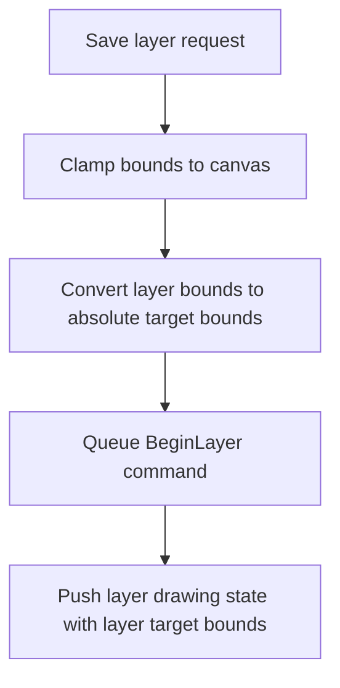
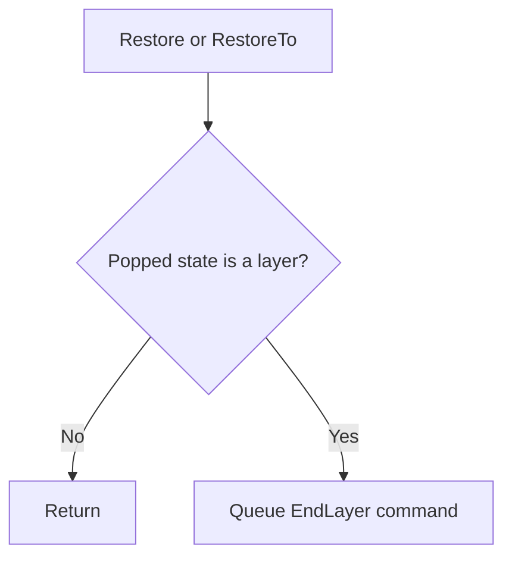
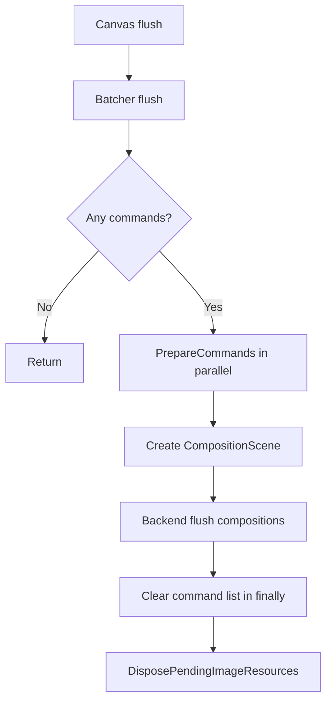
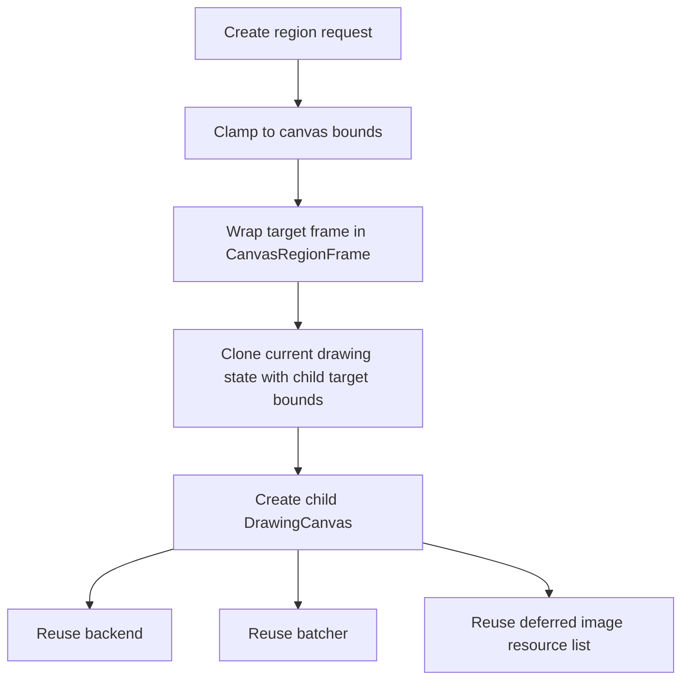
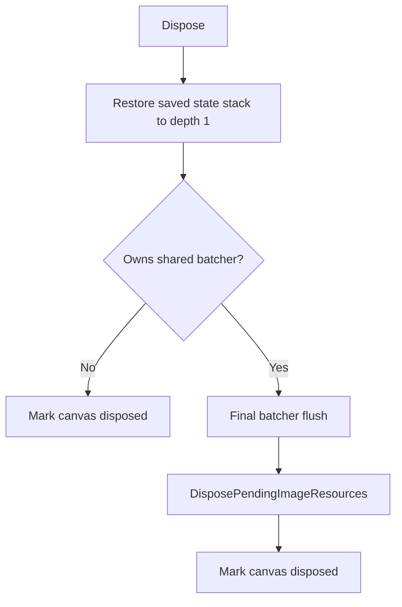
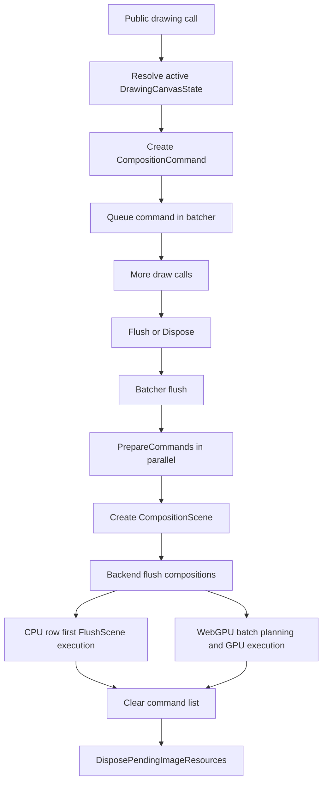

# DrawingCanvas

This document describes how `DrawingCanvas<TPixel>` records drawing commands, manages state, handles layers, and hands work off to the drawing backend.

`DrawingCanvas<TPixel>` is a deferred renderer. Most public drawing calls do not rasterize immediately. They capture intent as `CompositionCommand` instances in `DrawingCanvasBatcher<TPixel>`. The real normalization work happens later, during flush, when each command is prepared and turned into backend-ready geometry.

## Overview

At a high level the canvas owns:

- a target frame
- a drawing backend
- one active batcher
- a stack of immutable drawing-state snapshots
- a stack of active layer records
- a list of temporary image resources that must stay alive until flush

The canvas itself is the public API surface. The batcher is the deferred command queue. The backend is the execution engine.

## Core Responsibilities

`DrawingCanvas<TPixel>` is responsible for:

- state-stack management (`Save`, `Restore`, `SaveLayer`)
- creating and queuing `CompositionCommand` instances
- routing drawing to the current batcher
- coordinating temporary image lifetimes for `DrawImage` and `Process`
- flushing queued work and releasing temporary resources

It is not responsible for:

- flattening paths
- stroke expansion
- clip application
- prepared geometry caching
- rasterization
- brush composition

Those all happen downstream during flush.

## State Model

The active state lives in `DrawingCanvasState`:

- `Options`
- `ClipPaths`
- `IsLayer`
- `LayerOptions`
- `LayerBounds`

`DrawingCanvasState` is an immutable snapshot. `ResolveState()` returns the top of `savedStates`, and every drawing call reads from that active state.

### Save And Restore

`Save()` pushes a non-layer copy of the current state.

`Save(options, clipPaths)` pushes a new snapshot with replacement options and clip paths.

`Restore()` pops one state. If the popped state represents a layer, the canvas composites that layer before returning to the parent batcher.

`RestoreTo(saveCount)` keeps popping until the requested save depth is reached.

## Layer Lifecycle

`SaveLayer` is the mechanism for isolated group rendering.

The canvas no longer flushes or switches to a temporary backend frame.
Instead it records inline layer boundaries into the shared command stream and
updates the active command target bounds for commands issued inside the layer.

### SaveLayer Flow



### Restore Layer Flow



### Important Layer Details

- Layer isolation now lives in the command stream as `BeginLayer` / `EndLayer`.
- Commands recorded inside a bounded layer use that layer's absolute target bounds.
- The CPU backend lowers layers inline inside `FlushScene`.
- The WebGPU backend lowers layers inline through staged clip/layer commands.
- Explicit `Restore()` and implicit disposal both close layers by recording `EndLayer`.

## The Batcher

`DrawingCanvasBatcher<TPixel>` owns the pending command list and flush boundary.

Its job is narrow:

- accept queued `CompositionCommand` instances
- prepare them during flush
- package them into a `CompositionScene`
- call `backend.FlushCompositions(...)`
- always clear the command queue afterward

### Flush Pipeline



### What Preparation Does

`CompositionCommand.Prepare(...)` is where command normalization happens:

- apply the queued transform to the source path
- expand strokes to fill geometry when a `Pen` is present
- apply clip paths
- build or reuse `PreparedGeometry`
- transform the brush into the prepared geometry space
- recompute raster interest
- recompute brush bounds
- recompute the coverage definition key


## Command Creation

Public canvas methods do not do heavy geometry work. They capture inputs and queue commands.

### Fill

`Fill(brush, path)`:

- resolves the active state
- closes the path
- computes placeholder rasterizer options from the current bounds
- queues a `CompositionCommand`

The queued command still contains:

- the original path reference
- the original brush
- the active transform
- clip paths
- graphics options
- placeholder rasterizer metadata

### Draw

`Draw(pen, path)` follows the same pattern, but:

- forces `IntersectionRule.NonZero` for stroke semantics
- uses `RasterizerSamplingOrigin.PixelCenter`
- stores the `Pen` so preparation can expand stroke geometry later

### Clear

`Clear(...)` is implemented as a fill under a temporary state with `GraphicsOptions` modified for clear semantics.

### DrawText

`DrawText(...)`:

- resolves the active state
- uses `RichTextGlyphRenderer` to build drawing operations
- sorts operations by render pass where needed
- converts operations to `CompositionCommand` instances
- queues them in submission order

Glyph-local paths can stay shared up to command preparation, which matters for repeated glyph bodies.

### DrawImage

`DrawImage(...)` is the main exception to the "queue raw intent" rule. It performs eager image work before queuing the final fill:

1. crop and/or scale the source image
2. if a canvas transform is active, bake that transform into the image pixels
3. align the transformed bitmap to integer canvas bounds
4. create an `ImageBrush`
5. queue a fill for the final destination path

After eager image transformation, the queued image command uses:

- an identity command transform
- clip paths already transformed into the same space as the baked image

That avoids applying the canvas transform twice.

### Process

`Process(path, operation)` is read-modify-write:

1. flush queued work first
2. compute a conservative source rectangle from the path bounds
3. ask the backend for pixel readback
4. mutate the readback image through `IImageProcessingContext`
5. create an `ImageBrush` over the result
6. queue a fill back into the canvas

## Frame Model

Every batcher targets an `ICanvasFrame<TPixel>`.

`ICanvasFrame<TPixel>` exposes:

- `Bounds`
- `TryGetCpuRegion(...)`
- `TryGetNativeSurface(...)`

Implementations:

- `MemoryCanvasFrame<TPixel>`: CPU-backed frame
- `NativeCanvasFrame<TPixel>`: native or GPU-backed frame
- `CanvasRegionFrame<TPixel>`: clipped view over another frame

The backend decides how to execute against the frame it receives.

## Transform Handling

Transforms live in `DrawingOptions.Transform`.

For path-based drawing, the transform is queued on the command and applied during `CompositionCommand.Prepare()`.

For image drawing, the transform is baked into pixels before the command is queued.

### Transform Responsibilities

- paths: transformed during command preparation
- brushes: transformed during command preparation
- images: transformed eagerly in `DrawImageCore(...)`

## Clipping

Clip paths are stored on the active `DrawingCanvasState` and attached to queued commands.

During preparation, clipping happens after transform and after stroke expansion:

```csharp
path = path.Clip(shapeOptions, clipPaths);
```

For strokes, the ordering is:

1. transform path
2. expand stroke to outline
3. apply clip
4. build prepared fill geometry

## CreateRegion

`CreateRegion(region)` creates a child canvas over a clipped sub-region.



The child canvas gets local bounds `(0, 0, clipped.Width, clipped.Height)`.
Commands recorded through that child use the child frame's absolute bounds as
their target bounds and derive destination offsets from that same origin.

## Disposal

`Dispose()` is structured, not just a final flush.



Important detail:

- `Dispose()` always unwinds active saved states through the same `EndLayer` recording path used by `Restore()` and `RestoreTo(...)`
- only the owning canvas flushes and releases the shared deferred image resources
- child region canvases therefore do not force an early flush when they are disposed

## Backend Touchpoints

`DrawingCanvas<TPixel>` talks to the backend through these operations:

- `FlushCompositions(...)`
- `TryReadRegion(...)`

`DefaultDrawingBackend` executes the CPU path.

`WebGPUDrawingBackend` can supply native surfaces and GPU execution while still fitting the same canvas contract.

## End-To-End Command Flow



## Practical Reading Guide

If you are tracing behavior in code, these are the most useful entry points:

- `DrawingCanvas{TPixel}.cs`
- `DrawingCanvasBatcher{TPixel}.cs`
- `CompositionCommand.cs`
- `DefaultDrawingBackend.cs`
- `FlushScene.cs`

Start at the canvas public method, then follow:

1. command creation
2. batcher flush
3. command preparation
4. backend execution

That path matches the real runtime behavior much more closely than the public API surface alone.
